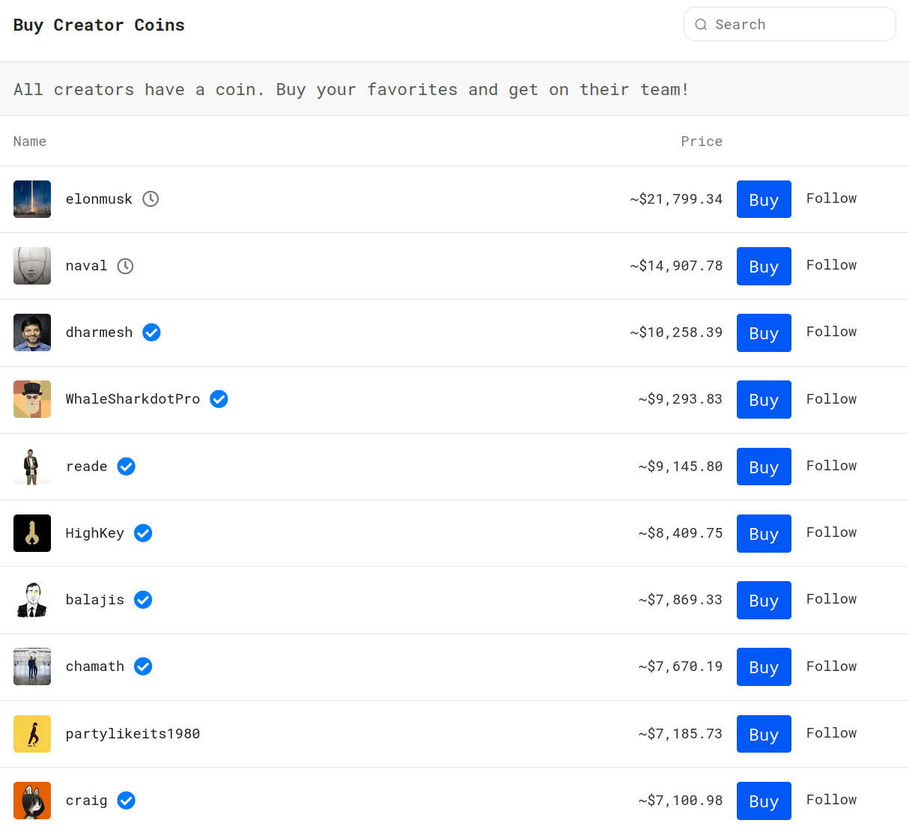
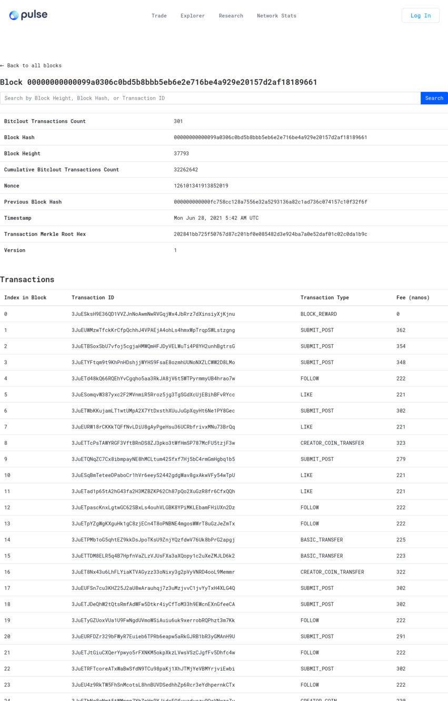
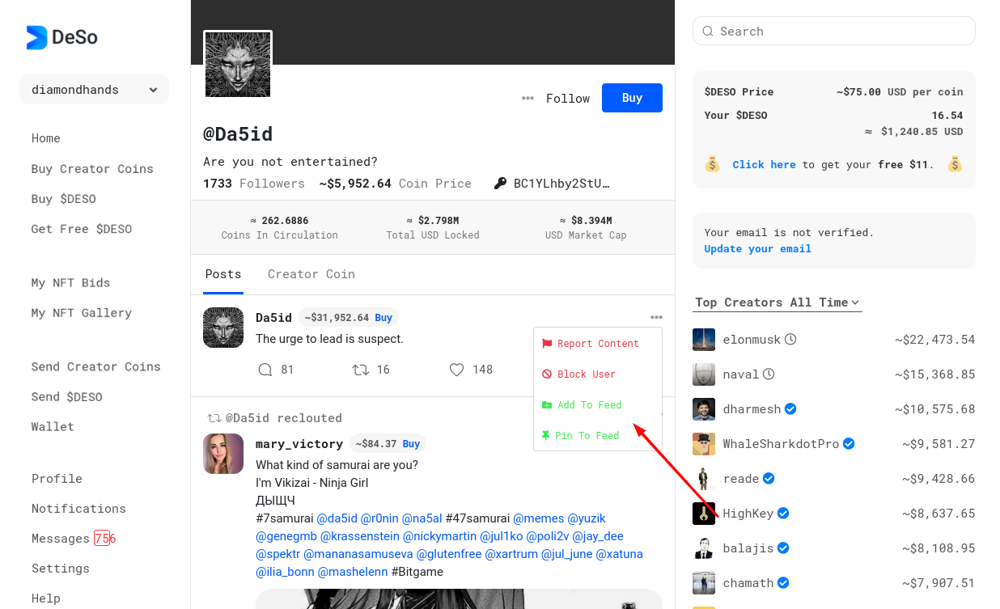
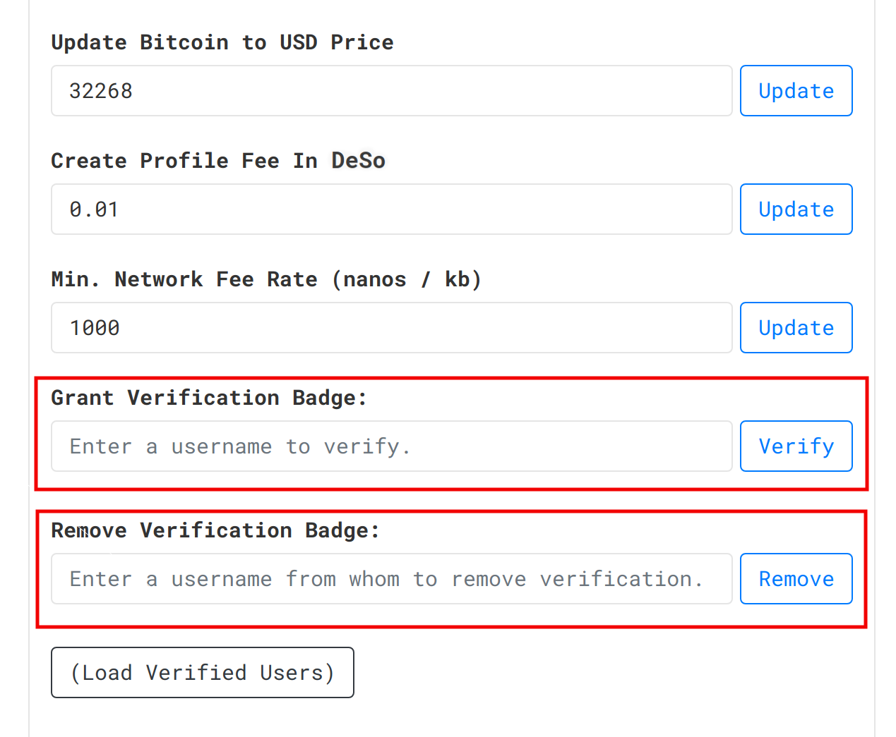
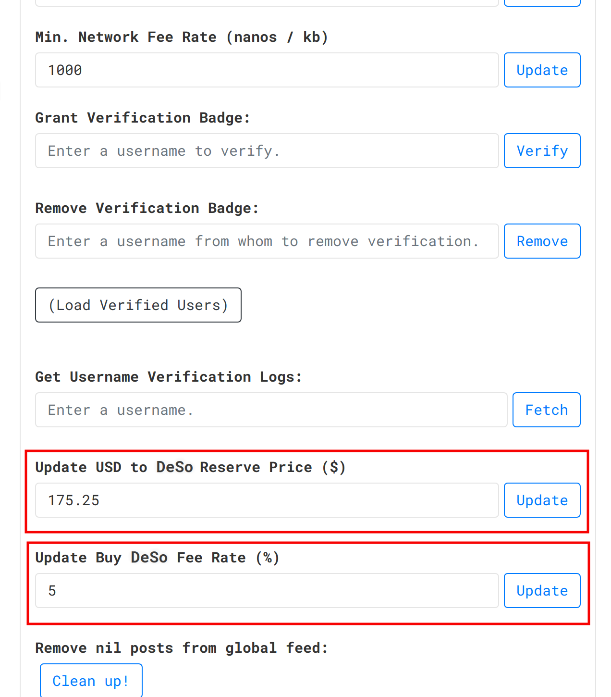

# DeSo: The Decentralized Social Network

## Introduction: The Value of Decentralizing Social Media

Today, social media is even more centralized than the financial industry was prior to the creation of Bitcoin. A handful of private companies effectively control public discourse, and earn monopoly profits off of content that they don't even create. Meanwhile, the creators who actually produce this content are underpaid, under-engaged, and under-monetized thanks to an outdated ads-driven business model. In addition to all of this, the ads-driven business model also forces social media companies to keep a walled garden around content created on their platforms, preventing external developers from innovating or building apps on top of it, and giving users and creators no choice but to continue using apps that solely they control.

These problems stem from the fact that the data and content created by users today is privately owned by a handful of companies, rather than publicly accessible as an open utility. Because only a handful of companies have access to the content, only these companies can curate competitive feeds, only these companies can build competitive new features and apps, and only these companies can monetize this content-- content that isn't even created by these companies in the first place. We're stuck in a loop: Users have to use these companies' apps because they have a monopoly on the content, and because of this, creators are forced into continuing to give their content up to them in order to get reach, in a vicious cycle that continues to empower these companies at the expense of creators and society as a whole. These companies have managed to create a global network effect around a private pool of content that they solely monopolize. Moreover, this centralization of content seems unavoidable: There's value in combining all of the content into a single pool, since it allows for curation at a global scale, but whoever we put in charge of maintaining the pool is ultimately going to become a centralized gatekeeper like what we have today. A solution would arise if we had a way to shift the network effect to a public pool of content that no individual entity controls-- but can it be done?

We believe all of these problems can be solved by decentralizing social media in the same way Bitcoin and Ethereum are decentralizing the financial system. In particular, Bitcoin created a way to store transactions on a public ledger that no individual entity can monopolize, which has led to the disruption of the financial industry, and we believe this technology can now be extended, for the first time, to store social media content without needing to rely on a centralized gatekeeper. Bitcoin and Ethereum have shown that dominant platforms can be built around open code and open data, rather than around private companies that monopolize their data and benefit shareholders at the expense of everyone else. Bitcoin and Ethereum don't have data moats to protect. In fact, the more open they are and the more people that build on top of them, the more value accrues to Bitcoin and Ethereum holders. This open model for software is already disrupting financial institutions all over the world, from banks to exchanges, and we think, for the first time, this model can be extended to disrupt the social media giants and their outdated ads-driven business models. If we can start putting social media content into a public blockchain, rather than giving it to a handful of private companies to monopolize, we believe we can create an economy of scale around that blockchain that is powerful enough to rival, and ultimately surpass, what the traditional social media giants have created. In some sense, we can solve a collective action problem among independent publishers by making it individually rational for them to contribute their content to a new globally-shared pool that they can never be di-intermediated from and that, for the first time, isn't controlled by a single company.

In this paper, we introduce DeSo, short for "decentralized social," the first and only blockchain custom-built from the ground up to power and scale a new category of decentralized social applications to one billion users. While much research has been dedicated to scaling "decentralized finance" or "DeFi" applications, relatively little has been invested in building blockchains that can scale social media applications, even though the latter category is arguably just as large, if not larger, and holds just as much promise for value creation. Moreover, while several general-purpose blockchains tout their ability to scale to tens of thousands of transactions per second, none of these blockchains is currently equipped to handle the unique storage and indexing requirements of social media applications at scale. To use an analogy from the centralized world, the infrastructure that powers the New York Stock Exchange today is vastly different from that which powers Facebook, Instagram, or Twitter -- they have completely different architectures tailored to support their respective applications at a massive scale. Similarly, our thesis with DeSo is that a blockchain that can scale decentralized social applications to one billion users will likely look vastly different than a blockchain that can scale DeFi apps to the same level. Thus, we believe the future of crypto does not consist of a single general-purpose blockchain that rules them all, but rather a series of dominant, specialized blockchains, each tailored to a particular category of applications. DeSo represents a more than two-year effort to create a blockchain capable of decentralizing the social media category, and we believe it presents the first clear path to solving the existing problems that plague social media today.

## The Ultimate Vision

Today, a post submitted to Instagram, TikTok, or Twitter belongs to these corporations, rather than the creator who posted it. And the monetization goes predominantly to these corporations as a result.

In contrast, DeSo stores all of its data on a public blockchain, which means that anyone in the world can run a node that exposes their own curated feed. Today, bitclout.com operates one such node, but there are [over 100 other projects](http://bithunt.com/explore) running nodes and building apps on DeSo as well. Moreover, there is no reason why other "verticalized" players can't enter the market to create feeds that they're uniquely suited toward curating. For example, imagine if ESPN ran a node that curated a feed of the best sports content. Or if Politico ran a node that curated a feed of the best political content. Additionally, since DeSo is fully open-source, these players could even customize their UI and build custom algorithms to rank the influencers and posts in a way that serves their specific target customer. We think this will quickly move us from a world in which a handful of juggernauts control the dominant feeds to one in which consumers will have thousands of feeds to choose from, each with its own specific focus.

On top of that, storing all of the data on a public blockchain makes it so that, with one engineer, anyone can build a social media experience that's competitive with the existing incumbents. It cannot be overstated the extent to which this lowers the barrier to entry for creating new social media products. It becomes possible for existing publishers to trivially spin up social apps and experiences as direct adjacencies to their core business, and allows upstarts to innovate on a relatively even footing with megacorps for the first time. Compare this to today where building a competitive social app generally requires building a billion-user data moat first.

The best part is that anyone who runs a node to curate their own feed also contributes data back to the public pool of profiles, posts, follows, etc... that's stored on the public blockchain. A post or a like on ESPN's node can be surfaced on Politico's feed. A post made in China can be surfaced on a feed running on a node in America and vice versa. And with every node that runs, more content gets contributed back to the global data pool stored on the blockchain, making every other node on the network more powerful and more engaging to users. In some sense, DeSo can solve a collective action problem among independent publishers: Instead of being forced to contribute to a privately-owned data pool controlled by a megacorp who's not aligned with them, publishers can now contribute to a public data pool that nobody controls and that they'll never be dis-intermediated from. Thus we can move from a world in which data is a heavily guarded, privately-owned resource to one in which it is more like a globally accessible utility that anyone can build on.

* Importantly, there is a strong incentive for publishers to contribute data back to the blockchain because not doing so would deter the top creators from wanting to publish on them. After all, why would you publish solely on a closed platform that exclusively owns your data when you could additionally publish to the blockchain and have your post instantly available to every node/feed that's running on the internet?

We think all of the above can give the creators unprecedented reach, and a more direct relationship with their followers than has been afforded to them with existing platforms. But reach is only one side of the coin-- the other side is monetization.

Social tokens, social NFTs, and social tipping, three categories of products pioneered by DeSo, are already changing the game in terms of how creators monetize on the internet, but they're only the beginning. Because DeSo is money-native and open-source, anyone in the world can start to experiment with new ways for creators to monetize by building an app on top of DeSo. For example, imagine a major creator who wants to start offering premium content in exchange for a monthly subscription. All it takes is for one person on the internet to build this feature, and the entire ecosystem of DeSo applications gets access to it instantly. The same goes for other features like an inbox where creators can be paid to repost content, or paid to answer messages from their followers. And this goes for other things like detecting harmful content or weeding out spam, where the best machine learning researchers in the world can build solutions, with access to the full firehose of data, without asking for permission, no matter where they are. The DeSo blockchain is fundamentally an open protocol that the entire world can build on collaboratively, which we believe will ultimately create even more ways to unlock creators' true potential, and which will bring competition and innovation back to social media.

Moreover, because DeSo is money-native, new signals emerge that can be used to rank content more effectively. For example, the first experiment that was launched by the bitclout.com app was ranking comments by the social token price of the commenter. Amazingly, this extremely simple ranking mechanism has already produced results that are competitive with centralized platforms. Ranking messages by coin price has also significantly reduced spam for influencers in a way that's truly unique to DeSo apps, and this is still just the beginning. Imagine what else will be built off of the "$DESO Signal" once the entire world starts building on and contributing to DeSo.

Finally, it's important to mention that we designed DeSo from the ground up so that the incentives of the system keep it decentralized, even in the long run. Creators have a strong incentive to post directly to the blockchain, rather than to a centralized app that withholds their content from the blockchain. And there's virtually no possibility for developers to lose access to data or APIs because all the data is publicly available on the blockchain, and they already have all the data when they run a node. Compare this to traditional social media companies, which start open to build a network effect and then shut off access after they've built a winning data moat.

With your help, we hope to build the DeSo blockchain into an enduring positive force for humanity that can bring competition and innovation back to the internet. The internet started as a fundamentally decentralized ecosystem, but we’re at a point in history where things have concentrated and where innovating is harder than it used to be. After much thought over the past several years, we are convinced that the pendulum will swing back toward decentralization, perhaps permanently, and we all have an opportunity to be a part of that. A new generation of applications that the entire world can build collaboratively, unlocking the full potential of human ingenuity.

## How Does DeSo Work?

In terms of architecture, a good way to understand DeSo is to imagine a Bitcoin node, only evolved to be able to handle a much wider array of transaction types than just sending/receiving money, with a vast amount of custom storage and indexing logic tailor-made to support social features at scale.

For non-developers, the best way to understand DeSo's architecture and its advantages is to continue to the next section, which explains things in high-level terms. However, for developers who are interested in diving into the lower-level specifics, [this developer quide](https://docs.deso.org/code/dev-setup) is a good starting point, and this [code walkthrough](https://docs.deso.org/code/walkthrough) is the best way to fully internalize how everything fits together. It may look dense, but it is written in plain English, and shouldn't take more than an hour or two to fully internalize.

### Social Features on Bare Metal

While traditional blockchains like Ethereum are extraordinary for creating open financial ecosystems, they are not designed to scale to handle the storage and indexing requirements of running competitive social media applications. For example, DeFi applications typically require the updating of balance entries in-place, without creating a new "state," whereas every post on a social platform creates a new state that needs to be stored and indexed in a certain way. Many issues like this make social media a special use case that we believe needs to be unbundled, and given its own dedicated architecture, in order to be properly served.

DeSo's biggest advantage lies in the fact that it is _not_ a general-purpose blockchain. Instead, it supports a narrow set of social-oriented features that it implements on bare metal, using custom indexes that every node builds during consensus when it syncs from its peers. In contrast, general-purpose blockchains must run all functions through a virtual machine, which is typically orders of magnitude slower than running on bare metal, and even then they cannot build custom indexes for querying as they sync.

As a very simple example, consider a social transaction that updates one's username. A node needs to check that the username is not currently held by another user before it allows this transaction to go through. Simple, right? Except that when you have just a million users, this lookup becomes prohibitively expensive on even the most advanced general-purpose blockchains today. In contrast, because DeSo can support this lookup with access to bare metal, it can cheaply and efficiently create a simple key-value index that is as fast as it would be for a centralized social application, and that can even be sharded across multiple disks or nodes as the user-base grows. The advantages of bare metal only increase as usage increases and as more use-cases are considered, such as checking that a parent post exists before allowing someone to reply, or even checking that an NFT is for sale before allowing someone to place a bid \(noting that Ethereum's lack of support for on-chain bidding has caused significant centralization and concentration to occur around NFT marketplaces\).

As another simple example, consider displaying a simple list of a user's most recent posts. Because general-purpose blockchains do not generally support ordered lists, this is not even possible without building an off-chain index. In contrast, DeSo natively supports indexes such as posts ordered by timestamp, profiles ordered by the value of their coin, NFT bids organized by which NFT they're associated with, and much more, and all of these indexes can scale as the user-base grows. This significantly reduces the complexity of running a node, which in turn can significantly increase the decentralization of the ecosystem, and the number of apps that can be built on top of DeSo.

As one final example, even the mempool of DeSo nodes was written from scratch to support queries for social data, without requiring users to have to wait for blocks to mine. This seemingly minor optimization is critical in order for DeSo apps to feel "instant," and we believe DeSo would not be competitive with traditional centralized social apps without it.

### The Importance of Storing Everything On-Chain

Some would argue that social applications can get by without storing everything on-chain. For example, one could imagine an Ethereum-based app that registers a user's public key on the blockchain initially, but then stores all posts on a centralized server. The problem with such an app is that whoever is running the centralized server has a significant incentive to, eventually, become a gatekeeper just like the social juggernauts we have today. This is especially true if the app is structured as a for-profit company, since its fiduciary duty to its shareholders will inevitably accelerate its transformation into a closed walled garden of content. Moreover, this risk means that developers building on top of this ecosystem will be deterred from ever investing in it, and even those that do will have trouble raising money. In contrast, we have seen the exact opposite play out with DeSo: [Over a hundred projects](https://bithunt.com/explore) are building on the blockchain, many former-YC founders, many backed by blue-chip venture capitalists like Social Capital and TQ Ventures, and we know first-hand that none of them would have been funded without DeSo's credible commitment to open on-chain data.

Thus, with DeSo, we believe it is tantamount to store every piece of data we possibly can directly on the blockchain, and to adjust the architecture of the chain by whatever means necessary to maintain this. In the long-term, we believe this value will prove critical not only in ensuring that DeSo's growth surpasses that of other networks, but also in ensuring that DeSo's end-state does not mirror the closed, highly-centralized social ecosystem we have today.

To be concrete, below is a complete list of everything that DeSo is currently equipped to store on-chain, and the notable exceptions:

* All profiles
* All posts and comments
* All private messages between users, which are end-to-end encrypted
* All likes and follows
* All social token activity
* All social tipping activity
* All NFT activity, including NFT bids
* All $DESO transfer activity
* Links to all rich media, such as video and images
* All profile verifications via a new verification paradigm called "associations" \(coming soon\)
* Exceptions:
  * Raw images and videos are stored in centralized but publicly accessible and easily replicable repositories, making the on-chain links sufficient to guarantee access into perpetuity.
  * Emails and phone numbers are stored by individual node operators in order to protect users' privacy. We do not think this presents a significant centralization risk; however, if this proves incorrect then this information can be encrypted and stored with the profile in a privacy-preserving fashion relatively easily.
  * Decisions about what profiles to show or hide, or how to curate content, lie with node operators. However, we think this is a positive force for decentralization, as we will discuss when we cover moderation.

As more features are added to DeSo, we will continue to ensure that all data that could pose a centralization risk lives on-chain. Moreover, we believe immensely that this value will come to separate DeSo from other more centralized efforts in terms of the value that can be created.

## Blockchain-Native Social Features

At launch, the DeSo blockchain supports not only traditional social features like creating profiles and posts, but also novel blockchain-native features like social tokens, tipping, and NFTs. These features alone enable vast new categories of money-enabled products, from social NFT experiences to influencer stock markets. These products in turn can allow creators to earn orders of magnitude more money on DeSo-enabled apps than on traditional social networks, while maintaining a more direct relationship with their followers. Moreover, creators aren't locked-in to a handful of centralized apps with DeSo because the business model of DeSo revolves around transactions flowing through a decentralized network of potentially thousands of third-party apps, similar to how Ethereum works today for DeFi applications. We believe this more decentralized business model can come to replace the traditional ads-driven business model for social media, which inherently requires concentrating users into a few highly centralized apps in order to maximize profit.

## The First Step: Buying $DESO

The DeSo blockchain has its own native cryptocurrency, called $DESO, that you can use to do all kinds of things on the platform, including buying a new type of asset called [“creator coins,” discussed below.](./#what-are-creator-coins)

Anyone can buy the DeSo cryptocurrency with Bitcoin in minutes through the blockchain., available on [the “Buy DeSo” page](https://buy.deso.org). The supply of DeSo is capped at [approximately 10.8 million](https://bitclout.com/posts/7bf4cfb5a9328c0f42c74454479ce4f889938157ae8208ae9d8120bf5b0f3ffc), roughly half that of Bitcoin, making it naturally scarce.

## What are Social Tokens? \(aka Creator Coins\)

### Everyone Has a Coin

Every profile on the DeSo gets its own coin that anybody can buy and sell. We call these coins “creator coins,” and you can have your own coin too simply by creating a profile. The price of each coin goes up when people buy and goes down when people sell.

### You Can Buy Your Favorite Person’s Coin

To buy someone’s coin, you simply navigate to their profile on any DeSo app, such as bitclout.com, and hit “Buy.” You can find someone’s profile either by searching for it or by visiting the creator coin leaderboard \(shown below\).

### What Are Creator Coins Useful For?

Creator coins are a new type of asset class that is tied to the reputation of an individual, rather than to a company or commodity. They are truly the first tool we have as a society to trade “social clout” as an asset. If people understand this, then the value of someone’s coin should be correlated to that person’s popularity. For example, if Elon Musk succeeds in landing the first person on Mars, his coin price should theoretically go up. And if, in contrast, he makes a racial slur during a press conference, his coin price should theoretically go down. Thus, people who believe in someone’s potential can buy their coin and succeed with them financially when that person realizes their potential. And traders can make money buying and selling the ups and downs.

The above being said, there are many other exciting opportunities for creator coins that we hope will be integrated in the very near future:

#### **The Stakeholder Meeting**

A creator can make it so that only people who own a certain amount of their coin can participate in the comments section of their posts. This forces anyone who wants to have a voice in that creator’s content to first align themselves with the creator by buying their coin. The alignment not only reduces spam significantly, but it could bias conversations to be significantly more positive than on existing platforms. It would also create a lot of demand for one’s coin-- can you imagine if Elon Musk or Chamath did an AMA with a minimum threshold for buying their coin in order to participate? Or if they answered questions in order of coin holdings?

#### Premium Messages

Most creators get a torrent of spam in their social media message inboxes. With DeSo they could make it so that only people who own a certain amount of their coin can message them, or they could simply rank and prioritize messages from the largest holders of their coin. Alternatively, they can make it so that a certain amount of their coin must be paid to them directly in order for the message to actually enter their inbox. All of this would increase demand for their coin while helping to minimize spam for the creator.

#### Sponsored Posts

Creators can have an “inbox” where anyone can “bid” to have them repost \(aka “retweet”\) a particular post. If you want Kim Kardashian to retweet your fashion brand, you can submit an entry into her inbox, and if she retweets it then she keeps your money. The bids can all be made using the creator’s own coin, thus significantly increasing the demand for the coin.

#### Premium Content

People who own a certain amount of a creator’s coin get access to special content. Or, alternatively, people must pay a monthly subscription in the form of the creator’s coin in order to get premium content.

#### Distributions and Engagement

Creators can also use their coins to distribute scarce resources to the largest holders of their coins. For example, imagine if a famous celebrity offered to have lunch with whoever held the most of their coin at a particular date. Or imagine if they were going to offer 1,000 signed posters to their 1,000 largest holders. This is just the beginning of how creators can engage with their fans using their coins, and all such ideas could increase demand for their coin significantly.

#### Money Likes

Likes can be re-imagined as purchases of the creator’s coin. So it costs money to like something, but you get that person’s coin when you do so \(effectively as a shortcut to buying their coin that’s associated directly with their content\). Such a feature could serve as a stronger signal on what content is high quality as well.

#### Emergent Phenomena

What can happen when you give people the ability to speculate on a person’s reputation? We can’t know for sure, but one feature that has emerged is what we call “buy and retweet.” Ordinarily, retweeting someone gives you nothing. If that person becomes a superstar because you boosted them, you’ll be lucky if they even remember your name in a few years. In contrast, with DeSo you can buy someone’s coin and then retweet them, which makes it so that you’re not only along for the ride financially if they blow up, but you also get bragging rights. Imagine the difference between being able to say “I retweeted her early on” vs being able to say “I bought her coin when it was $5 and now it’s $5000-- and by the way, I’ve done this hundreds of times, and I can prove it because my track record is on the blockchain.” The interesting thing about this mechanic is that it wasn’t even something consciously designed into the product. It exists as an “emergent” phenomenon off of the core creator coin mechanic. What other dynamics could exist that we haven’t yet thought of?

### The Creator Coin Supply Curve

Creator coins are naturally scarce, with generally fewer than 100 to 1,500 coins in existence for each profile. This is because as more people buy a profile’s creator coin, the price of the coin goes up automatically at a faster and faster rate. This means that, eventually, it would take billions of dollars to mint even one more coin.

The formula or “curve” for determining the price of a creator’s coin is as follows. Note that creator coins are normally bought and sold with the DeSo cryptocurrency, but we provide a dollar version of the formula for easy calculating:

$$
price\_in\_deso = .003 \times creator\_coins\_in\_circulation^2
\\
price\_in\_usd = .003 \times creator\_coins\_in\_circulation^2 \times deso\_price\_in\_usd
$$

When you create a profile, there are initially zero coins in existence and thus the price is zero. If you want to buy coins from the profile, it will happily mint them on-chain and sell them to you according to the price curve above, making it more and more expensive as more coins are purchased. The money you use to buy the coins gets “locked” in the profile in exchange for the coins. On the flipside, if you want to sell coins, the profile will happily buy them from you according to the curve using the money locked from previous buys. And so buying **creates** coins while pushing the price **up** and **locking** money into the profile, while selling **destroys** coins while pushing the price **down** and **unlocking** money from the profile. This is often referred to as an “automated market-maker,” and it’s the same concept that powers protocols like Uniswap and Bancor.

Below is a graph of what the creator coin price curve looks like as a function of how many creator coins are in circulation for a given profile. We also include a table that shows some of these values. Both of these assume a DeSo price of $16. Note also that “integrating” the price curve yields the amount of money “locked” in a profile, which is equal to the “net” amount of money that has flowed into that particular creator coin \(included as the third column of the table\). If you’d like to play with the numbers yourself, you can do so using [this sheet](https://docs.google.com/spreadsheets/d/1ecMscQTY4rhmfrAn-5SRspiZqhhttVo1Pj880A4EDuo/edit?usp=sharing) \(make a copy to edit it\). You can also learn more about bonding curves [here](https://yos.io/2018/11/10/bonding-curves).

| **Creator Coins in Circulation** | **Creator Coin Price \(USD\)** | **USD Locked in Profile** |
| :--- | :--- | :--- |
| 5 | $1.20 | $2 |
| 10 | $4.80 | $16 |
| 20 | $19.20 | $128 |
| 40 | $76.80 | $1,024 |
| 80 | $307.20 | $8,192 |
| 160 | $1,228.80 | $65,536 |
| 320 | $4,915.20 | $524,288 |
| 640 | $19,660.80 | $4,194,304 |
| 1280 | $78,643.20 | $33,554,432 |

### Founder Rewards

Every profile allows the creator to keep a certain percentage of the coins that are created as a “founder reward.” For example, if someone sets their founder reward percentage to 10% and then someone buys 100 DeSo of their coin, then 10 DeSo would go to the creator’s wallet rather than the purchaser’s.

The above being said, we think the better way for creators to own a piece of the upside of their coin is simply to buy their coin up-front when they create their profile, and then set their founder reward percentage to zero. This works because the coins are cheapest at the beginning of the curve, and it has the upshot of reducing friction on subsequent purchases of their coin. Nevertheless, the founder reward percentage being 10% is a “sane default” that guarantees creators will maintain a certain percentage of their coin even if they do nothing.

## What are Social NFTs?

Non-Fungible Tokens \(NFTs\) are digital assets that can be bought and sold, typically representing a piece of digital content. For example, an artist can publish a digital image as an NFT, and put it up for sale to the highest bidder. When they do this, the history of who owns the image can be tracked on the blockchain as a way of showing the art piece's provenance. And even though anyone in the world can typically see the image, there is only one person who provably owns it, just as if the piece were a painting hanging in a museum.

The easiest way to really understand NFTs, though, is to actually look at some examples. Below we list examples of popular NFT concepts, as well as popular NFT platforms, all of which served as the inspiration for the DeSo NFTs product. **Importantly, because DeSo is an inherently social platform, we anticipate the use-cases for NFTs will extend far beyond just digital content, and we discuss this in detail in the next section.**

Examples of popular NFT concepts:

* [Beeple's collage](https://www.theverge.com/2021/3/11/22325054/beeple-christies-nft-sale-cost-everydays-69-million)
* [CryptoPunks](https://www.larvalabs.com/cryptopunks)
* [Bored Apes](https://boredapeyachtclub.com/)
* [CryptoKitties](https://www.cryptokitties.co/)
* [NBA Topshots](https://nbatopshot.com/)

Popular NFT marketplaces:

* [OpenSea](https://opensea.io/)
* [Nifty Gateway](https://niftygateway.com/)
* [Rarible](https://rarible.com/)
* [SuperRare](https://superrare.co/)
* [Zora](https://zora.co/)
* [Foundation](https://foundation.app/)
* [Valuables by Cent](https://v.cent.co/)

### The DeSo Advantage: Mixing NFTs and Social Media

When someone buys a piece of art or a collectible item, they do so in part because it brings them personal joy, but in part because they want to show it off. A major superpower DeSo has is that every feature that's added to it has an inherent social component built-in, and NFTs are no exception.

In the case of DeSo NFTs, we have an opportunity to show off a user's NFT collection on their profile, and to allow users to engage around their NFTs via comments, likes, diamonds, and more. Suddenly, the act of buying an NFT shifts from a purely personal and/or economic motive to an inherently social one. In addition, because DeSo has a native concept of identity in the form of a user's profile, the reputation of the issuer is tied into the NFT in a much more meaningful way, especially for celebrities and superstars with pre-existing brands. This not only increases the value of DeSo NFTs, but we think it will also lead to all kinds of interesting dynamics that mix collecting, flexing, and social.

Below are just some examples of the possibilities...

#### **New NFT Use Cases**

* **Collectible ticket stubs.** If you were to sell tickets to a concert in the form of DeSo NFTs, then every attendee would automatically get a virtual ticket stub on their profile commemorating the event that their friends would get to see \(not to mention the extra promo you'll get from your coin-holders!\). Could you imagine if [@3LAU](https://bitclout.com/u/3LAU) sold his tickets as DeSo NFTs? This mechanic could also be used to sell tickets to exclusive events like the premiere of a movie or an exclusive gala.
* **Physical memorabilia: The digital collector's room**. Imagine selling a physical piece of memorabilia, like a prop from a movie set, with an NFT attached, issued by the original seller, that the

  buyer gets to flex on their profile. This turns a user's profile into an inventory of their collector's room, where you can see all of the cool things they own, both in the digital and physical world, with

  NFTs serving as certificates of authenticity issued and signed directly by the original seller. Could you imagine if someone like [@GeorgeTakei](https://bitclout.com/u/georgetakei) from Star Trek cleaned out his closet one day using DeSo NFTs?

* **Exclusive experiences.** Selling experiences as NFTs makes unique sense on DeSo. For example, creators with large followings can offer to have dinner or to host a Q&A with a handful of their biggest fans by minting and selling a "one of 10" NFT. With DeSo, because NFTs are inherently social, the creator can engage their followers by asking them to comment explaining why they want to join before they place a bid. The creator then has full control over determining the winners, and those winners not only get to meet the creator, but they also get to sport the fact that they did on their

  profiles forever. Maybe [@wolfofwallst](https://bitclout.com/u/wolfofwallst) could give Warren Buffet's charity lunch some competition!

* **Exclusive unlockable digital content.** DeSo NFTs have an "unlockable" portion that only the winner of the NFT gets to see. This creates interesting use-cases around selling hyper-exclusive digital goods. For example, an artist can drop an album a week early as an unlockable 1/10,000 NFT such that only her true fans who win the NFT are able to listen to it ahead of time. This would result in extra cash flow for the artist while still allowing them to capture the same streaming revenues a week later. Could you imagine getting early access to [@thechainsmokers](https://bitclout.com/u/thechainsmokers)' next album, and getting an NFT along with it?
* **Exclusive chat groups.** Creators can offer exclusive chat groups using DeSo NFTs to gate

  access. For example, a creator can sell a 1/100 NFT such that any current owner of the NFT is able

  to participate in an exclusive Telegram group, weekly Zoom call, etc... We already saw this happening with creators like [@craig](https://bitclout.com/u/craig), but it also makes sense for sports insiders like [@adamschefter](https://bitclout.com/u/adamschefter).

* **Interactive content.** For content creators, DeSo NFTs can be used as a way to solicit feedback from fans, or to guide the direction of content. For example, the creator of a podcast can sell an NFT where the winner gets to decide what their next episode is going to be about. The creator can solicit comments from users before they place their bids, and they have ultimate control over whom they choose as the winner. Alternatively, music artists can offer to put an NFT winner's name in a song or include them in a music video, and the winner would have the NFT on their profile to commemorate the experience. The creator of a movie or short film could sell producer credits in the final cut as NFTs. Could you imagine if the winner of a DeSo NFT could decide the topic for [@shaanvp](https://bitclout.com/u/shaanvp)'s next show, or win a shoutout at the end of a [@jakepaul](https://bitclout.com/u/jakepaul) or [@loganpaul](https://bitclout.com/u/loganpaul) fight? How about a Clubhouse AMA with [@alexisohanian](https://bitclout.com/u/alexisohanian), where the winners of a "one of 10" NFT get to come on-stage first? Or maybe we can finally get [@BennyBlanco](https://bitclout.com/u/BennyBlanco) to bring us that DeSo Boys single we've all been waiting for, as a gloriously sought-after NFT.
* **Counterfeit-proof Rolexes, Chanel handbags, etc...** Major brands have a big problem with

  counterfeiting: A real Rolex is worth much more than a knockoff, but knockoffs can often be

  so good that it's difficult to tell them apart. Now, imagine a solution based on DeSo NFTs

  whereby a luxury brand creates an official DeSo profile and offers an NFT associated with

  every single sale of their products. Now, a user not only gets digital, unforgeable proof that

  they own a real item, but they also simultaneously get to show off their purchase on their profile that all of their friends can see. Then, if they ever resell their Rolex, they can transfer the NFT along with it, allowing it to serve as a certificate of authenticity issued and digitally-signed directly by the brand, and that tracks the provenance of the item for its entire lifetime.

* **Digital trading cards.** Any sufficiently well-known creator can create digital trading cards of themselves simply by issuing a "one of N" NFT. All they need to do is create a unique piece of artwork, like a [cryptopunk](https://www.larvalabs.com/cryptopunks) drawing of themselves, and their biggest fans can sport it on their profiles. Notably, each DeSo NFT has a serial number, so each one will be special, even within the same issue. [@ab](https://bitclout.com/u/ab), could you be the first DeSo NFT trading card!
* **Fine art.** Major artists have shown that NFTs are going to be a big part of the future of fine art. They not only allow anyone to enjoy the artist's work, but they also do a much better job of tracking the ownership of a piece, which means the provenance can't be forged. The fact that DeSo also incorporates the artist's identity, via their profile, into the minting of an NFT should, we hope, further increase the value and utility of NFTs issued by artists. Artists on DeSo have already been innovating extremely fast, and we're so excited to take things to the next level with DeSo NFTs. Maybe we can even get [@beeple](https://bitclout.com/u/beeple) to finally claim his profile!
* **The future of Charity.** Charities can create profiles on DeSo, just like ordinary people. When they do this, anyone can elect to send them DeSo as part of the sale of their NFT. For example, someone could auction off a dinner with themselves, but specify that all the proceeds will go to The Red Cross. They would then be able to digitally prove that the funds went to that charity. Alternatively, a charity can participate in the fun directly by issuing NFTs of their own. For example, a charity could issue NFTs where each one represents a particular acre of trees that will be planted. This allows the owner to show off their contribution to any cause they care deeply about, which could significantly increase the amounts people are willing to give. It's a bit surprising that social media and charity aren't more closely linked today-- but we believe DeSo can finally change that, and make giving easier and more fun than ever before.
* **Owning a piece of history.** On DeSo, any post that a user makes can also be minted

  as an NFT and sold. The user who "owns" the resulting NFT can be seen as owning a piece of

  history. For example, if a sitting US president theoretically joined DeSo in the future and

  used it to make a monumental announcement, like the end of US COVID lockdowns, someone could

  own that very special post, and all proceeds could be donated to a charity of the president's

  choice. We'll also settle for another shirtless pic of [@chamath](https://bitclout.com/u/chamath), though, just to be clear.

The above list is just the beginning; it's just what we've come up with so far. We can't wait to see what else the community can produce with DeSo NFTs.

In the past, NFTs and social media have been separate: You mint an NFT on some platform and then post about it on social media. Now they come together, as they were always meant to be, increasing engagement, reach, value, and monetization for creators.

### NFT Cashflows to Coin-Holders

Creator coins are a major DeSo superpower that we are taking to the next level with NFTs. On DeSo, a percentage of the sale of each NFT can be sent back to a creator's coin-holders as a cashflow \(including on secondary sales\). With this key feature, DeSo NFTs "close the loop" between a creator's activities on DeSo and the value of their coin.

**Suddenly, creator coins are no longer objects of pure speculation; rather, they are directly linked to a creator's activity on the platform. This means that, for the first time, followers can participate in a creator's growth rather than watching from the sidelines as they rise to stardom.** This has never been possible before, and it changes the relationship between a creator and their fans, from one in which fans pay for their work, to one in which they invest in the creator, and grow together.

Moreover, tying cashflows to creator coins makes it so that any creator who wants to market a new piece of content has a whole army of coin-holders that are invested in their success, and will help them spread the word. Distribution is no longer solely the creator's job, and they don't need to sign their life away to a corporation in order to get it. Your fans are your investors and your distributors at the same time because they're economically aligned with you in a way that wasn't possible before DeSo.

Finally, and perhaps most interestingly, these cashflows do not ultimately inhere to the creator themselves; rather, in the same way a Picasso painting continues to fetch a high price after its original primary sale, a creator's NFTs on DeSo can continue to trade and produce cashflows for creator coins long after the creator is gone. **Thus, in some sense, tying cashflows to creator coins makes owning them analogous to owning a percentage of every sale of every piece of work the creator has or will ever produce on DeSo. Could you imagine if Picasso had a creator coin linked to all of his works?**

### How DeSo NFTs Work

The easiest way to see how DeSo NFTs work is to try and create one on a DeSo app like bitclout.com.

Very simply, the steps to minting and selling a DeSo NFT are as follows:

* Create a post, which consists of a snippet of text and an embedded image or video. All

  NFTs on DeSo start as posts, and you can turn any pre-existing post into an NFT.

* Hit "Mint NFT" and select from the options:
  * You can mint either a "one of a kind" or "one of N" NFT. In the latter case, there will be multiple winners of the same piece of content.
  * The creator can set a creator royalty and a coin-holder royalty. This is a percentage of the sale that will go to the creator and to the creator's coin-holders as a cashflow. This cashflow hits on every **secondary sale** of the NFT as well. The DeSo platform does not take a fee. Note we are working on allowing arbitrary public keys to be specified as a means of programmatically distributing proceeds to other accounts, such as charity accounts.
  * Optionally, the creator can set a piece of unlockable content that only the winner of the NFT will get access to. This feature enables hyper-exclusive experiences to be built on DeSo NFTs, like one-of-a-kind songs that only the winner can listen to.
* Once an NFT is minted, users can bid on the NFT. They must have enough in their wallet to cover the bid, but nothing is withdrawn from their wallet until the auction is closed by the creator. This allows users to bid on as many things as they like.
* Whenever the creator is ready, they can close the auction by selecting a winner, or winners in the case of a "one of N" NFT. Importantly, the creator has full control over who gets to own their work; they don't have to give it to the highest bidder.
* Once the auction is over, the winner\(s\) get to show off the NFT on their profile. It shows up in their NFTs tab, and it can be pinned to their main page.

We didn't want to over-complicate things, and we believe this simple set of features enables all of the interesting use-cases described previously.

Finally, as a means of concentrating liquidity around certain NFTs, we have designed a system that allows node operators to schedule "showcases." Showcases work as follows:

* A node operator selects a collection of NFTs that they want to showcase.
* The node operator schedules these NFTs to "drop" at a certain time.
* At the scheduled time, the new NFTs are showcased on the Home page in their own tab.

Using this system, a node operator can curate a collection of NFTs every week, or even more frequently, and engage the community around them. **This, in some sense, allows node operators to serve as the curators of their own digital galleries, with each drop introducing a new exhibition.**

## What is Social Tipping?

Because DeSo is money-native, it can tie tipping with content in ways that no other social network can. On DeSo, the core mechanic introduced is called "diamonds," and it functions as a like, only it allows users to give variable amounts of money to content.

In the screenshot above, a single diamond is a penny while a six-diamond is ~$362. All of this is instant, and the receiver of the tip immediately gets $DESO in their wallet for their content. Many users already earn thousands of dollars a week off of this feature alone, and as DeSo scales, the economics will only get better.

Just to do some math, imagine a post with 1 million likes gets 100,000 diamonds, worth on average ten cents each. That's $100,000 in pure cash from _just_ the diamonds! Moreover, users typically get a higher ratio of likes to diamonds, but we wanted to be conservative in our calculations.

## Proof of Stake

Today, DeSo runs a hybrid Proof of Work consensus mechanism that allows it to use far less energy than Bitcoin or Ethereum while remaining secure against 51% attacks. Its current power consumption can be estimated via websites such as bitpool.me, and we believe it to be significantly less than 500 Kilowatts.

This being said, the core development team behind DeSo has invested significant resources into developing a groundbreaking proof of stake proposal that we expect to reveal in the coming weeks, and that we expect to launch before the end of the year 2021. Importantly, this proposal, like everything else with DeSo, will be especially well-suited to supporting the unique constraints of social applications.

## A Simplified Scaling Roadmap

There are currently many different, and suitable, ways that the DeSo architecture can be scaled to support one billion users. Fundamentally, as long as the feature set is kept sufficiently narrow, with an intense focus on keeping everything as close to bare metal as possible, then most of the tools and lessons of scaling centralized social platforms like Instagram can be directly applied to scaling DeSo.

The above being said, we think it's valuable to provide a scaling roadmap with calculations so that blockchain enthusiasts can take comfort in the existence of a concrete path to one billion users.

Below, we detail a concrete scaling roadmap with four relatively straightforward phases:

* Phase 1: Proof of Stake.
* Phase 2: Bigger blocks.
* Phase 3: Warp sync.
* Phase 4: Sharding.

The math below walks through DeSo scalability at each stage:

1. Proof of Stake
   1. While PoS is not strictly required in order to scale DeSo, it is a top priority regardless, and so it will either precede or happen in parallel with the other scaling steps.
2. Bigger blocks
   * The average DeSo blockchain post size is **218 bytes**.
   * There are 10 other [transaction types](https://github.com/deso-protocol/core/blob/135c03a/lib/network.go#L239) besides `POST`, such as `LIKE` and `FOLLOW`. In a recent block, posts were about **1/3** of the total block size.

     

   * The DeSo blockchain currently produces up to 2MB blocks every 5 minutes, as you can see from [bitcloutpulse.com/explorer](https://bitcloutpulse.com/explorer).
   * So it can scale to ~30 transactions per second, **which is ~10 posts per second** \(= 2e6 bytes/block / \(218 bytes/post \* 60 seconds/minute \* 5 minutes/block\) \* 1 post / 3 transactions\).
   * If we increase the block size to 16MB blocks every five minutes, we can roughly extrapolate that it scales to ~240 transactions per second = **~80 posts per second**.
   * For comparison, Twitter has approximately [6000 posts/second](https://www.dsayce.com/social-media/tweets-day/#:~:text=Every%20second%2C%20on%20average%2C%20around%206%2C000%20tweets%20are%20tweeted%20on,August%202014%20with%20661%20million.) on average with 300M users.
   * So, at 80 posts per second, we should be able to roughly accommodate about 80/6000 = 1.33% of 300M users, or **4M users**.
   * That’s where we can get with a basic block size increase alone. But we have a few other cards to play.
3. Warp sync
   * With an Ethereum-like [warp or snap sync](https://blog.ethereum.org/2021/03/03/geth-v1-10-0/), we loosen a key constraint, which is the need for all nodes to always validate the entire history of transactions. \(You can still run an archival node, but this won’t be necessary for normal operations.\)
     * As a concrete example, if all you're downloading is the current creator coin balances for each user, then all that user's trades are effectively compressed into a few integers because you don't care about the history \(only the end state\).
   * Instead, we move to a model where nodes by default first sync and validate a snapshot of the current blockchain state and then sync only a few week's worth of blocks on top of that.
   * Generally, the bottleneck to blockchain performance is validation speed. With DeSo, we've run tests that indicate a node running on an Intel Xeon E-2276M can validate transactions at the rate of **~12MB/s = 1.04TB/day = ~55,000 txns per second**.
   * So, if we start by just downloading the state with minimal validation, how big can it be? To download 10TB at 10gbps = 10e12/10e9\*8/60/60 takes about ~2.2h. To download 100TB at 10gbps = 10e12/10e9\*8/60/60 is about **~22.2h to download the state**. 
   * With warp sync, the block size can be increased beyond 16MB because the number of blocks required to get a node up-to-date can be reduced to only one week's worth of blocks rather than the entire history of blocks from the beginning of time.
   * Let’s suppose then that using warp sync we increase the block size further to 120MB blocks. How many transactions per second \(TPS\) would 120MB blocks every 5 minutes facilitate? If we assume 218 bytes per transaction \(which is what the value is per post\), then \(120e6 bytes / \(5 minutes \* 60 seconds/min\)\) / \(218 bytes/txn\) =  **~1,800 transactions per second**.
   * How much bandwidth would it take to synchronize one week of 120MB blocks appearing every 5 minutes, and how long would it take in wall clock time?
     * Bandwidth would be roughly \(120e6 bytes/block \* 1 block/5 minutes \* 60 minutes/hour \* 24 hours/day \* 7 days/week\) / 1e9 bytes/GB = 238GB/ week
     * At the aforementioned validation speed of 12MB/s on an Intel Xeon E-2276M, it would take approximately 238e9 bytes/week / \(12e6 validated bytes / second \* 60 seconds/minute \* 60 minutes/hour\) = **5.5-6 hours to download and validate one week of 120MB blocks** at a validation speed of 12MB/s on good hardware.
   * Under these assumptions, This means that the warp upgrade can allow us to sync a node in ~5.5h while maintaining 1,800 transactions per second \(TPS\) long-term.
     * 1,811 tps vs Twitter with 6,000 posts per second and 300M users \(assume only posts, no likes\)
     * Users = 300M \* 1,811 / 6000 / 3 txns per post = **~30M users.**
4. Sharding
   * All transactions can then be write-sharded to make syncing a node parallelizable, thus providing multiple orders of magnitude in speedup. For example, we could do a very simple optimization, which is to shard all posts into their own sub-chain, and then shard other transactions across two of their own sub-chains.
   * This would result in a node being capable of syncing 3x faster, meaning that we could support **~90M users without an increase in sync time**.
   * Ultimately, all transactions can be sharded into sub-chains by user ID, which would allow for virtually unlimited parallelization. For example, with thirty shards, we achieve another ~10x multiplier on the TPS without an increase in sync time, thus achieving **~1 billion users**.
   * This number can be scaled further by increasing the number of shards.

## The Future of Moderation

Moderation of content is an absolutely critical topic when it comes to building a decentralized social network, and it is probably the topic we have spent the most time on besides engineering design.

First, because all of the data on DeSo is open, an ecosystem around moderation can develop that is more robust than what can be achieved with a traditional company. For example, because the data is open, the best machine learning researchers at the best academic institutions in the world can build API’s that label all of the content on the blockchain in a way they can’t today, which can then be consumed by all node operators that want to remain compliant. This would create an economy of scale around moderation that we believe can be more robust than what’s possible within the confines of a single corporate entity. All of the data being open also allows the Federal government to better analyze the spread of misinformation, and be more involved in preventing it, than they can be when all of the content people are seeing is locked up in a corporate walled garden.

Moreover, at a high level, we start by considering a spectrum of how decentralized the internet can be. Right now we are on the very “centralized” side of the spectrum, where small moderation teams at a few companies control the vast majority of public discourse. We think this is too far on one end of the spectrum, but we also think that the opposite end, where there is total anarchy with regard to content, is even worse. DeSo sits in the middle: It leverages the same moderation scheme that governed the pre-Facebook internet, which we think deters harmful content without stifling innovation and competition.

Any website that displays harmful content is subject to both federal and civil litigation, whether its content comes from a blockchain or from a USB drive. This is what prevents harmful content from seeing the light of day on the internet today, even though there are many people who could theoretically serve it. It’s also largely how the pre-Facebook internet was kept in check, and it’s the same mechanism that prevents nodes on the DeSo network from serving harmful content.

On bitclout.com, a node we operate, we are exposing a subset of all of the posts on the blockchain and, obviously, for content that is harmful or illegal, we will never show it on bitclout.com. Every node that runs on top of the DeSo blockchain, including apps like Flick or CloutFeed, can expose whatever subset of the posts that they want. This being said, showing illegal or harmful content would not only subject them to copious amounts of litigation, but it would also likely make it such that nobody would want to use them. That content will still technically be on the blockchain but it won’t be practically accessible.

## Running a Node

Running a node gives you full access to the DeSo firehose. Access to every profile, post, follow, creator coin trade, etc... But what can you do with all this power?

### **Running your own feed**

When you run a node, it starts with a blank global feed and an "Admin" panel that you can use to start adding posts to it. **All of the same tools that the bitclout.com team uses to manage their global feed are now available to you to manage a feed of your own.**

Essentially, running a DeSo node allows you to expose your own "view" of the firehose of content. Our bitclout.com node exposes all of the crypto-related content, but when you run your own node you have full control to surface whatever content speaks to you. What will you do with your feed? Here are some ideas for feeds that we think would be popular:

* **A feed for every country and every language.** Isn't it weird that people all over the world consume information curated predominantly by the US? How much does an engineer working in Silicon Valley really know about what people in other countries want to see, or what features they want? In the past, we were stuck with this model because US companies built a data network effect that entrenched them, even in non-US countries. But DeSo can break this status quo because all of its data is open and the barrier to entry to starting a competitive feed is virtually zero. For the first time, people who actually live in a country can curate a feed for their people, no matter how large or small their country is. And this applies to every country that succumbed too quickly to the network effects of the Silicon Valley tech companies. By lowering the barrier to entry to creating a feed, and opening up the data firehose to anyone, we think DeSo has the potential to bring international social media products to a whole new level.
* **The politics-focused feed.** bitclout.com doesn't prioritize political content, but someone should. Imagine a feed where all the posts from the top political figures are highlighted. You could even imagine segmenting the firehose into two feeds: a "red" feed and a "blue" feed that's dedicated to each political party.
* **The sports-focused feed.** Wouldn't it make sense for someone to operate a feed that just highlights all of the best sports content from the best sports influencers? So many people are interested in this content, and we think it deserves its own feed.
* **The NSFW feed.** bitclout.com doesn't prioritize NSFW content in its feed because its user-base is too mainstream. This bias against NSFW content is even stronger with incumbent social media companies. Yet there are so many talented adult influencers on bitclout.com, with thousands of followers, who are posting every day. It's about time they had their own feed dedicated to them.

We're just scratching the surface here-- it's now up to you, the community, to figure out how best to display the DeSo firehose. Reddit pioneered the concept of a "Subreddit," but the problem with a Subreddit is that every time one is created, it has to solve a "chicken and egg" problem with regard to its content. If nobody is posting, then the subreddit has no content-- but without content, nobody will start posting. DeSo basically takes the subreddit concept to the next level by solving the "content" part of the equation for everyone. When you run a node, you don't need to bootstrap content because you have full access to the DeSo content. All you need to do is curate it in some interesting way and you'll have created value for anyone who visits your node.

### Add social to your platform

Suppose you're a platform with millions of users like Coinbase or Robinhood, or even traditional media companies like ESPN. Your users would probably love it if you could integrate a social component into your products-- but you can't because Twitter and Facebook don't allow it. They [closed down their APIs](https://theverge.com/2018/8/16/17699626/twitter-third-party-apps-streaming-api-deprecation) a long time ago because they realized that third-party integrations eat into their ad revenue. Every user who engages on a third-party platform is a user who's engaging less on Twitter and Facebook.

With DeSo, you don't need to build a billion-user data moat in order to be able to add social features to your platform. All you need to do is run a DeSo node, and use its API to expose whatever content you want. Suddenly, with just one engineer's worth of effort, any major platform can spin up a social product that's adjacent to its core business. Moreover, it's possible that the best feeds will come from existing publishers that have already built a competency in a particular area. For example, ESPN might be the best entity to run the sports-focused feed because of their relationships and connections, and now they can.

### Analysis tools

Building the best analysis tools requires access to the best data, and running a node is the best way to get full access to the DeSo firehose. Until now, the bitclout.com nodes have had to set up rate limits to avoid having our machines get overloaded. But now, because DeSo is a blockchain that allows anyone to run a full copy of the platform, anyone who wants to build analytics tools can simply run a node and query it in whatever way they want.

### Invent your own features

When you run a node, you have the flexibility to expose the DeSo content in whatever way most resonates with your users. We recommend starting with the source code of bitclout.com frontend, but if you wanted to, you could even build a whole new frontend with totally different features than what the "default" node gives you. If you feel like bitclout.com is missing a feature, like dark mode, or paid messages, or better filtering for spam for example, now you can build it and run your own node to back it.

### Making Money on Your Node

Incentives are key to making DeSo truly decentralized in the long run. It's not sufficient that nodes be runnable by the community, they must be _profitable_ to run as well. Many cryptocurrencies struggle with this, and even Bitcoin and Ethereum nodes are still largely run by volunteers. DeSo is truly unique in this regard, however, because the social features it introduces give node operators incentives that other blockchains don't have.

The above being said, there are several ways that DeSo node operators can earn a profit:

* **Promoted content.** Because running a node comes with the ability to have a social media product with minimal marginal effort, every node operator has an opportunity to amass and monetize the reach that comes from curating a popular feed. This can be as simple as showing promoted posts that partners pay the node operator to pin to their feed.
* **Trading fees.** Anyone who runs a node can modify their frontend to add trading fees on every creator coin trade, which go to the node operator's wallet. By doing this, any node operator basically doubles as a crypto exchange.
* **Other transaction fees.** Any transaction users complete on one's node can be augmented to contain a small fee that goes to the node operator. Thus there should eventually arise an efficient market for node operator fees that are high enough to justify operating a node.

The above mechanisms don't even factor in profits that could be derived from augmenting the DeSo feature set. For example, if someone creates an app experience for DeSo that is significantly better than alternatives, they could even charge a monthly subscription fee or some other premium to cover costs.

### How to Run a Node

Running a node currently requires a modest amount of technical know-how. For the full instructions on how to run a node, check out this GitHub repository:

* [https://github.com/deso-protocol/run](https://github.com/deso-protocol/run)

Once a node is running, it syncs all of the blocks from its peers, as well as the transactions in the "mempool," which have yet to be mined into a block. Every node comes with an Admin panel with a Network tab that allows you to monitor the node's sync state.

Once your node is synced, you have access to the full firehose of DeSo data in real-time! Below are some tips on how to take full advantage of your node.

* Go to your Admin tab and watch the unfiltered feed update as your node syncs. It's like a time machine!
* Try to whitelist some posts in the Admin tab and see that they've made their way onto your global feed.
* Read through the flags available in the [dev.env](https://github.com/deso-protocol/run/blob/main/dev.env) file. You can adjust these flags however you want, but note that we strongly recommend keeping your node in read-only mode for now. Turning read-only mode off could cause users who visit your node to make transactions that are not ultimately confirmed.
* Set `ADMIN_PUBLIC_KEYS` to your public key so that the Admin tab is only visible to your username.
* Set `SUPER_ADMIN_PUBLIC_KEYS` to your public key so that the Super Admin tab is only visible to your username.
* Whitelist some posts and verify that they show up on the global feed.
* Deploy your node on any cloud provider with a static IP to make it accessible to anyone on the internet.
* Set a `PASSWORDS_FILE` if you want to restrict read access to your node.
* Add an `SSL_CERT_DIR` and `SSL_DOMAIN` using a letsencrypt cert in order to protect your node with HTTPS.
* Set the `TWILIO*` flags to allow new users to get some starter $DESO.
* Set a `SUPPORT_EMAIL` so your users can contact you if they run into trouble.
* Play with the logging verbosity by increasing `GLOG_V`.

### Managing Your Feed

To manage your feed, start by navigating to the Admin tab as shown below. The Admin tab shows the full firehose of posts in real-time, with a button next to each one that allows you to add it to the global feed. You can also sort the posts by clout. These are all the same tools that the bitclout.com mods have, now at your fingertips through the power of decentralization.

You can also add any post from anyone's profile to the global feed simply by hitting the dropdown at the top-right of the post. You can also pin posts to your feed, which is a good way of communicating announcements to your user base.

When you run a node, you act as a moderator and have a variety of superpowers that help you manage spam and harmful content.

* **Blacklisting** a profile removes it everywhere except peoples' wallet pages. This makes it so that anyone who was holding the blacklisted profile can sell out of their holdings.
* **Graylisting** a profile removes it from the leaderboard, removes it from search, removes its comments from threads, and removes its posts from the Admin panel.
* **Whitelisting** a profile makes that user's posts show up on the global feed automatically with some frequency \(currently it allows five posts per day\).
* Finally, a mod can allow a phone number to be re-used to claim starter $DESO. This is useful for various testing situations.

When you've set your public key as an `ADMIN_PUBLIC_KEY`, the Admin tab becomes visible only to you. This is a critical step in securing your node. Not doing this would make it so that all your users can add posts to the global feed.

### Super Admin Public Keys

Within the Admin Panel, there is a `Super` tab that is only accessible by Super Admins. Super Admin can manage user verification and $DESO purchasing behavior from the `Super` tab.

#### Username Verification

Super Admins can grant verification badges \(on their node\) to a user by putting the username in the `Grant Verification Badge` input box and then clicking `Verify`. Similarly, a Super Admin can revoke verification by putting the username in the `Remove Verification Badge` and then clicking `Remove`.

#### Buy $DESO Management

Any node can sell $DESO if they set the following flags appropriately. Super Admins can set two values in the `Super` tab to manage the price at which $DESO is sold on their node: `USD-to-DeSo Reserve Price`and `Buy DeSo Fee Rate`.

**USD-to-DeSo Reserve Price**

This is the minimum price at which you are willing to sell $DESO on your node. If the price retrieved from exchange APIs is lower than this amount, your node will sell $DESO at this reserve price instead of the API price. Additionally, the price in the right sidebar will appear as reserve price in the event that the price from the API dips below the reserve price.

**Buy DeSo Fee Rate**

This is a percentage-based fee applied to all $DESO purchased on your node. If the current price of $DESO in USD is $100 and the `Buy DeSo Fee Rate` is 5%, the buyer will pay $105 per $DESO and the node operator has earned $5 net. For more details on configuring your node to sell $DESO, please read the section titled `Sell $DESO on your node`.

### Sell $DESO on your node

To simplify the onboarding experience for new users on your node, you can sell $DESO for Bitcoin directly to users. To configure your node to sell $DESO, please set the following flags:

* `BUY_DESO_SEED`: This is a seed phrase for the public key that contains $DESO that you will sell to users. As with all seed phrases, keep this secret and share it with nobody. Take extra precautions to not commit it to version control and quickly move funds if this seed is ever compromised.
  * You will need to deposit $DESO to the public key for this seed phrase. All $DESO purchases on your node will send $DESO from this wallet.
* `BUY_DESO_BTC_ADDRESS`: This is a Bitcoin address you control. When users purchased $DESO with Bitcoin, the Bitcoin will arrive at this address.

### How Users Login

When a user logs in on your node, they have the ability to sign in with their DeSo identity, without having to re-enter their seed phrase. Once a user signs in, your node can sign transactions on their behalf with varying levels of approval required depending on what kind of permission the user granted. This creates a login mechanism for node operators that is as easy for users as "login with Facebook," but it unlocks a wallet in addition to a user's identity.

### Node FAQ

Answers to common questions and issues about running your own node:

#### What are the minimum requirements for syncing a node?

We recommend having a machine with at least 32GB of RAM and 350GB of storage \(as at 21 July 2021\). If TXIndex is disabled, then you need about 200GB in total. The Blockchain DB takes up about 90 GB, and the TXIndex takes up 160 GB. THe DB+TXindex size grows by about 50GB a month currently.

#### How do I configure SSL?

There is an example SSL configuration in `nginx.dev`.

#### How do I use the BlockCypher API?

BlockCypher will help prevent double-spends in the mempool. You can signup for a [BlockCypher](https://www.blockcypher.com/) account on the BlockCypher website. BlockCypher does offer a free amount of API calls.

Once you have signed up for an account you may copy a token from the [tokens](https://accounts.blockcypher.com/tokens) section of the dashboard.

You will copy this token in your `dev.env` file as the value for `BLOCK_CYPHER_API_KEY`.

#### What type of records do I use with custom domains?

You must create two seperate **A** type domain records.

Both records should point to the IP address of your node.

**Example DNS Records:**

| Hostname | Type | TTL | Priority | Content |
| :--- | :--- | :--- | :--- | :--- |
| node.`DOMAIN`.com | A | 299 |  | `IPADDRESS` |
| api.`DOMAIN`.com | A | 299 |  | `IPADDRESS` |

If you do not create both records you will be unable to use a custom domain.

#### Can my node write back to the mainnet?

Yes! Every transaction is broadcast to all other nodes on the network, and should eventually be mined into a block.

#### What does Twilio provide to my node?

Twilio provides an SMS API that allows you to confirm user phone numbers and thus send them currency from your seed wallet set inside the `dev.env` file. If you do not have this set users will be unable to verify a phone number.

