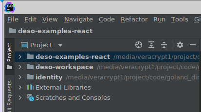

# ⭐ DeSo Tutorial (Build Apps)

### Getting Help

Up-front, if you ever run into trouble and want to talk to someone, the [DeSo PoS Discussion Telegram Channel](https://t.me/deso_pos_discussion) is a great resource. Everyone who runs a node is in there, as well as members of the DeSo core team. Many there are generally very knowledgeable on the ins and outs of the DeSo blockchain, and super helpful to new users trying to understand what’s going on. We used to run a Discord, but we’ve found a simple dev-focused Telegram channel works better.

If you ever run into issues while doing a swap, the [HeroSwap Support](https://t.me/heroswap) channel can help you. This shouldn’t be needed but we include it here for completeness.

And if all else fails, you can always get our attention by @-mentioning @nader, @lazynina, @stas\_kh, or @deso on any DeSo app, such as [Openfund](https://openfund.com), [Focus](https://focus.xyz), and [Diamond](https://diamondapp.com).

### Dev Setup

We recommend using a JetBrains IDE like [GoLand](https://www.jetbrains.com/go/) to get started. Even if you’re more familiar with tools like Emacs or Vim, using GoLand will make it a lot easier for us to help you debug what’s going on, and to use valuable plugins like GitHub Copilot for AI code suggestions.

Once you’ve set up GoLand, the next step is to import all the DeSo-related projects so that you can hop around the code effectively. You do this simply by executing the following steps:

* `git clone {repo}`
* Open up GoLand
* File > Open > `{project directory}`
* At this point, you will have the option of opening the directory in a new window or _**attaching**_ it to your existing project.
  * We recommend simply attaching all projects to a single window so that you can easily search through all of them using `CTRL+SHIFT+F`

We recommend loading up the following projects, for basic app development:

* [deso-examples-react](https://github.com/deso-protocol/deso-examples-react)
  * This is the main repo we’ll be playing with in this guide. Follow the instructions on the README page to set it up. Then import it into your IDE by following the previous steps.\

* [deso-workspace](https://github.com/deso-protocol/deso-workspace) (reference only)
  * This repo is intended only as a reference, and it is useful mainly because of the deso-protocol SDK that the example app uses ([README for that is here](https://github.com/deso-protocol/deso-workspace/tree/master/libs/identity)). Attaching this repo to your IDE will allow you to **jump to definitions** by using `CTRL+B`.\

* [identity](https://github.com/deso-protocol/identity) (reference only)
  * It’s a bit confusing, but this repo is actually the one that holds the users’ _**owner**_ keys, which we’ll talk about later, and it’s also the repo that does all of the signing.\

  * Put simply, the deso-workspace identity library, mentioned above, is a _**wrapper**_ around this repo, which does all of the **real** heavy lifting.\

  * As you will learn later, this repo holds the owner keys, while deso-workspace holds the _**derived**_ keys, which are used by each app to sign a limited set of transactions.\

* In addition, we recommend adding the other DeSo repos for reference purposes:\

  * [core](https://github.com/deso-protocol/core) (reference only)
    * This is DeSo’s layer-1 blockchain code that is run by all nodes on the network, including Coinbase, GateIO, and many others. It is the beating heart of DeSo’s infrastructure.\

    * Probably the most useful later on will be the list of all supported transaction types, which you can find [here](https://github.com/deso-protocol/core/blob/df1f4bb941d158675b48419d92ee24111dece621/lib/network.go#L205), with full documentation [here](https://docs.deso.org/deso-backend/construct-transactions). All the functionality the DeSo blockchain supports is encapsulated in this handful of transactions.\

    * The transactions included cover:
      * Sending/receiving DESO and other tokens\

      * Every NFT operation you can think of, including a fully on-chain marketplace, which no other chain is capable of powering.
        * You can see this functionality on [Diamond](https://diamondapp.com).\

      * Every token operation you can think of, including minting/burning, and a fully on-chain order-book exchange that can power 40,000+ matches per second, which no other chain is capable of. We call this the _DeSo DEX_.
        * The DeSo DEX is actually what powers the Openfund trade page [here](https://openfund.com/trade/Openfund). Everything is actually fully on-chain, so you can build your own fully-functional exchange off of it if you wanted to.\

      * On-chain end-to-end encrypted direct messages _**and**_ group chats, which no other chain supports.
        * You can see this functionality on [Diamond](https://diamondapp.com), and in our chat prototype [here](https://chat.deso.com).\

      * The full “Twitter” feature set, including the ability to create a profile with an on-chain profile picture, the ability to submit posts/comments, the ability to follow other users, interact, etc… all fully on-chain.\
        \
        No other chain is capable of powering an on-chain social graph like this.
        * You can see this functionality on [Diamond](https://diamondapp.com) and on [Desofy](https://desofy.app).\

  * [backend](https://github.com/deso-protocol/backend) (reference only)
    * The backend repo is a wrapper around the core repo that allows for querying and transaction construction, and it is what powers [node.deso.org](https://node.deso.org).\
      \
      It’s useful to have this repo attached to your project because all of the endpoints for **transaction construction** that you’ll be using live here.\

    * Probably the most useful later on will be the list of all the supported backend routes, which you can find [here](https://github.com/deso-protocol/backend/blob/eb04b7c298aeecd0c02aad2c9ea1422887060a6a/routes/server.go). All of these routes can be used to construct transactions, and interact directly with the chain.\
      \
      You can also see all the documentation for the backend routes [here](https://docs.deso.org/for-developers/backend/introduction).\

  * [frontend](https://github.com/deso-protocol/frontend) (reference only)
    * This is the frontend code that powers [node.deso.org](https://node.deso.org), and you can see examples for constructing all the relevant transactions we’ll be using in this repo.
    * Probably the most useful later on will be [backend-api-service.ts](https://github.com/deso-protocol/frontend/blob/main/src/app/backend-api.service.ts), which shows how to call all of the backend endpoints from a real-world frontend (though it doesn’t use the deso-workspace/identity library yet unfortunately, it does it through the raw identity library instead).\


Once you’ve loaded up all the repos, your GoLand “Project” panel should look something like this.

Simple:

<div> <figure><figcaption></figcaption></figure></div>

Advanced:

<div> <figure><figcaption></figcaption></figure></div>

If you chose to clone and attach all of the suggested repos (besides MegaSwap), **you actually have 100% of the code powering the DeSo blockchain sitting on your computer right now.**

Kinda cool, right? \
\
Such is the power of 100% open-source development.

### Going Deep (Optional)

For everyone who just wants to **use** the DeSo blockchain, there is no need to run a DeSo node, no need to dive into the core repo, or even to understand how all the repos fit together. **So if you just want to build an app, skip this section!**

The above being said, we know some people will want to understand how everything fits together.&#x20;

For this, there are a couple of other tutorials that you may find interesting:

*   [Running a node](https://docs.deso.org/about-deso-chain/readme#running-a-node) (quickstart guide [here](https://docs.deso.org/about-deso-chain/readme#how-to-run-a-node))

    * You already have all of the DeSo **code** on your local machine— but what if you could download the entire **social graph** onto your local machine as well?\

    * For most people, it is sufficient to simply use another node such as [node.deso.org](http://node.deso.org) to construct transactions and query.\
      \
      &#xNAN;_**BUT**_ if you’d like to run your own node, and download all of DeSo’s user data, including all profiles, posts, and follows from the beginning of time, then the above guide will show you how.\

    * It will also show you how to build and curate your own feed, if you want.


*   [Full code walkthrough](https://docs.deso.org/for-developers/walkthrough) (very optional)

    * This guide will walk through all the actual code in the backend, core, frontend, and identity repos (note it’s the **root** identity repo, not the deso-workspace one, which is just a wrapper).\

    * If you want to learn how one of the most advanced blockchains in the world functions at the core level, this guide is for you!


* [Understand the bigger vision](https://docs.deso.org/about-deso-chain/readme)
  * DeSo is about more than just moving money and content around. If we’re successful in our mission, we will fundamentally change how information is shared on the internet.\
    \
    Just by building on DeSo, you are now a part of this movement toward a more open and free world, and this doc will tell you all about it!

### Using DeSo in an Existing App (Optional)

The rest of this tutorial will focus on creating a new app from scratch, rather than modifying an existing app.

That said, if you would like to use DeSo in an existing app, then all you need to do is `npm install` the [deso-protocol SDK](https://www.npmjs.com/package/des-protocol).\
\
This will then allow you to `login()` users, sign transactions on their behalf, broadcast those transactions to the blockchain, and much more.

```
npm i deso-protocol
```

In what follows, we will show all the different ways to use this library by setting up an example app, and adding functionality to it.\


### Example App Setup (Recommended)

Once your IDE is loaded up with all the code you need, the next step is to get the example app up and running locally.\
\
The idea is that, once you get the example app running, you can use it as a starting point, and start modifying it into the **real** app you’re trying to build.

To get the example app up and running, simply follow the steps from the README on the example app’s GitHub.

[https://github.com/deso-protocol/deso-examples-react](https://github.com/deso-protocol/deso-examples-react)

Once you’re done, you should be able to visit [localhost:3000](http://localhost:3000) in an Incognito tab and see the following. We recommend you load it up in Incognito to avoid cluttering your main wallet:

<div> <figure><figcaption><p>localhost:3000</p></figcaption></figure></div>

Once your app is running, click the “Sign and Submit Transaction” tab, and go through the process of logging in and creating a post.\
\
This is implicitly exposing you to a `configure()` setup call, a `login()` flow, a transaction construction, and a call to `signAndSubmitTx`.\
\
As we will discuss, these basic building blocks will be pretty much all you need to do **anything** on DeSo, from basic social things to building a breakthrough order-book exchange or NFT marketplace!

### Tip for creating lots of test accounts

As you start developing on DeSo, you will quickly find yourself in need of creating new accounts with starter $DESO in them.\
\
Your phone number will work for getting through the login flow for about ten tries, but after that, it will stop working, and you’ll still want an easy way to test your flows.

While there is a [_**testnet**_](https://test.deso.org) flow that advanced developers use, the easiest way to test your login flows repeatedly is **send** starter DeSo to your wallet, rather than going through the phone number flow (and this is what most DeSo devs do on testnet as well).

To do this, go through the following steps:

* Create a “master” account either on [wallet.deso.com](http://wallet.deso.com) or on an app like [diamondapp.com](http://diamondapp.com) that you’re going to use as your main one. This could be your **actual** DeSo profile, and you would probably want to do this in a non-Incognito window so that it sticks around.\

* Buy a small amount of DeSo either on [Diamond](https://diamondapp.com), [Openfund](https://openfund.com), [wallet.deso.com/buy](http://wallet.deso.com/buy), [megaswap.xyz](https://megaswap.xyz/), or on Coinbase. You only need around $1 worth, and you can use fiat, Bitcoin, Ethereum, Solana, USDT, and USDC.\

* Once you have \~$1 of DeSo in your main account, load up your wallet in a separate browser window on any of the previously mentioned apps (e.g. Diamond, Openfund, etc…).\

* Now, in an incognito window, open up [localhost:3000](http://localhost:3000) to start your login flow “testing.”
  * You will want to run these tests in Incognito so that your wallet doesn’t get cluttered with lots of throwaway accounts.\

*   Click the login button to create a new account.&#x20;

    
* The fastest way to test your login flow is to use “Sign up with DeSo seed” to generate a fresh account. We on the core team run through this flow all the time because it’s quicker and more efficient than resetting our Google or MetaMask accounts. So just click “Sign up with DeSo seed.”
  * Copy and verify the seed. When testing the login flows, there’s not really a need to save the seed because it’s usually just a throwaway account.\

* You should reach this page with a couple of clicks:

<div> <figure><figcaption></figcaption></figure></div>

* Now, instead of using your phone number, click “Buy or Send $DESO Anonymously,” and scroll down to the “Transfer $DESO to your new account” section:

<div> <figure><figcaption></figcaption></figure></div>

* Now, send 0.00001 $DESO from your main account to the test account. It’s only about a hundredth of a penny, and your app will make much more than that when it’s successful don’t worry :)
  * Also, note that it says that you need to send 0.01 $DESO. Ignore that — you can get away with much less.\

* Now hit “Refresh” and it should let you through the flow, approve your permissions, and you’ll be good to go!
  * That amount of $DESO is good for about fifty “lightweight” transactions (uploading images and stuff like that costs a bit more).\
    \
    If you want to test flows that are more than that many transactions long, or that require you to upload data, you will want to send a bit more, or graduate to using testnet.\


The above is the actual testing cycle that the DeSo devs use to test production deployments after everything is working on testnet.\
\
As you can see, it costs a little bit of \$$, but you have to spend money to make money!

As an exercise, try creating a bunch of accounts via this flow just to make sure you’ve gotten the hang of testing.

### Onboarding funds with MegaSwap

[Megaswap](https://megaswap.xyz) is an amazing tool that allows you to onboard users’ funds onto the DeSo ecosystem (it also supports Bitcoin, Ethereum, Solana, USDC, USDT, and the gas-less DesoDollar stablecoin as well).\
\
You can think of it as your “Stripe for Crypto,” and you can add it to your app with just one line of code.\
\
We won’t go into it just yet, but it will be a key way in which users move funds onto your app.

To see examples of MegaSwap in action, check it out at [megaswap.xyz](https://megaswap.xyz), [Diamond](https://diamondapp.com/buy-deso), and [Openfund](https://openfund.com/wallet). Note that Diamond does a one-line [embed](https://megaswap.xyz/#/iframe/docs/v1) while Openfund uses the API documented [here](https://megaswap.xyz/#/api/docs/v1).

<div> <figure><figcaption><p>MegaSwap.xyz</p></figcaption></figure></div>

## Basic Configuration Options

Once your example app is running, our first step is to modify the permissions that the app is requesting to suit your needs.\
\
We will do this by modifying the call to the identity library (note that in everything that follows, unless stated otherwise, we will use **identity** to refer to the deso-workspace identity wrapper, not the **root** identity repo which does the actual signing and heavy-lifting).

### Transaction Spending Limits

Setting transaction spending limit options will determine what permissions your users will see when logging into your app, and the amount of $DESO your app can spend on their behalf (among other things).

On DeSo, every user gets a **master** or _**owner**_ keypair generated for them when they create an account for the first time, which happens automatically via the `login()` flow that you went through above and that we’ll talk about shortly.

This _**owner**_ key is able to sign _**any**_ transaction on behalf of the user, including spending _**all**_ of their money, and transferring **all** of their NFTs or tokens, **which is scary!**

Naturally, it wouldn’t be a good idea to give every app the user interacts with direct access to this key.

But we also don’t want to make users have to _**approve**_ every single transaction that an app wants them to do.

Can you imagine using Twitter if every like and comment required an annoying approval popup?

The solution is to allow apps to generate **subkeys,** which we refer to as _**derived**_ _keys_, that have a limited set of permissions approved by the _**owner**_ key.

The flow for generating a derived key and getting these permissions approved for your app is something that happened automatically in the login flow you did above, and it looks as follows:

*   User creates an account for the first time, generating an _**owner**_ public/private keypair that is stored in the **root** identity enclave (this is stored locally in the browser, but in a distinct **iFrame** that is not directly accessible to apps).

    * This is done via a simple call to `login()`, as the example app does [here](https://github.com/deso-protocol/deso-examples-react/blob/4abfdf739b38b3318d524aa713b85bebc1d196a1/src/routes/sign-and-submit-tx.jsx#L21).


* User gets some starter $DESO to cover gas, either by entering their phone number or buying some. The Identity popup supports this natively, and your users will automatically have this starter $DESO when the `login()` call returns successfully, as it does in the example app [here](https://github.com/deso-protocol/deso-examples-react/blob/4abfdf739b38b3318d524aa713b85bebc1d196a1/src/routes/sign-and-submit-tx.jsx#L24).\

* App generates a _**derived**_ key, which can just be any random keypair, and a distinct transaction granting this derived key certain permissions, e.g. the ability to post 3 times on the user’s behalf.
  * The derived key is generated in the call to `login()` referenced earlier, and it’s saved and managed by the Identity library, so you don’t have to really worry about it.\

  * The transaction granting the derived key the permissions you want is **also** automatically generated via `login()`, and you can specify exactly which permissions you want to ask the user for by calling `configure()` once at the beginning of your app.\
    \
    The example app shows you exactly how to do this in the root component [here](https://github.com/deso-protocol/deso-examples-react/blob/e9956588e6a509321bf386eec504c46dd3fd679e/src/routes/root.jsx#L12).\

* Once the derived key approval transaction is generated, the Identity wallet can prompt the user to _**approve**_ it, thus signing the transaction with the user’s _**owner**_ public key.
  * This all happens automatically in the `login()` call for you.\

* Once an approve txn is signed by the user’s owner public key, it can be _**broadcast**_ to the DeSo blockchain, which then gives the _**derived**_ key the desired permissions.
  * This all happens automatically in the `login()` call for you.\

* The app can then happily sign transactions on the user’s behalf, without the user having to worry about the app stealing their funds (also known as getting **rug-pulled** or **rugged**).\

* If you ever want to _**upgrade**_ the permissions your app has requested from the user, you can do this using a call to `identity.requestPermissions()`, as the example app shows [here](https://github.com/deso-protocol/deso-examples-react/blob/4abfdf739b38b3318d524aa713b85bebc1d196a1/src/routes/sign-and-submit-tx.jsx#L45). \
  \
  When you do this, the Identity library automatically handles the construction, signing, and broadcasting of the derived key approval transaction for you.\

* After you have the permissions you need, you can now start constructing, signing, and broadcasting **real** transactions on behalf of the user.
  * The example app shows you how to construct a submit-post transaction using the backend API available at [node.deso.org](http://node.deso.org) in this code snippet [here](https://github.com/deso-protocol/deso-examples-react/blob/e9956588e6a509321bf386eec504c46dd3fd679e/src/routes/sign-and-submit-tx.jsx#L61).\
    \
    Signing and broadcasting the transaction to the network is handled by the library. You only need to pass the data you want to be stored in the transaction to the `submitPost()` call.

Once you get your head around it, the process for doing **anything** on DeSo is really quite simple. \
\
First, you get the permissions you need from the user, then you construct, sign, and submit a transaction to the chain, which the deso-protocol SDK makes very simple for you.

### Unlimited Permissions

Although we will normally want to ask for a sober number of transactions, there are times where devs want to loosen the constraints on their apps, and we show how to do this below.

Below we ask users for permission to create an _unlimited_ number of posts and make an _unlimited_ number of transfers until they meet the global limit of 1 $DESO.

```jsx
import { configure } from 'deso-protocol';

configure({
  spendingLimitOptions: {
    // NOTE: this value is in Deso nanos, so 1 Deso * 1e9
    GlobalDESOLimit: 1 * 1e9 // == 1 Deso
    // Map of transaction type to the number of times this derived key is
    // allowed to perform this operation on behalf of the owner public key
    TransactionCountLimitMap: {
      BASIC_TRANSFER: 'UNLIMITED', // Sending/receiving DESO is a "basic transfer"
      SUBMIT_POST: 'UNLIMITED',
    },
  }
})
```


💡 You’ll want to make sure you call **configure** prior to calling any other identity methods.


Note that even though we approve an unlimited number of **basic transfer** transactions in the above configure() call, we cannot take more than 1 $DESO from the user’s wallet before we have to popup an approval again.\
\
This is a good thing for the user!

While you’ll typically want to ask for specific permissions in a production app, it is possible to ask for unlimited **god-mode** access for prototyping or quickly testing things.\
\
This example requests approval for unlimited access.

```jsx
import { configure } from 'deso-protocol';

identity.configure({
  spendingLimitOptions: {
    IsUnlimited: true
  }
})
```

### App Name

appName is used to identity the app that issues login keys. This can be used to group and identify derived keys that have been issued by a given app. If you don’t set the appName, the domain name your app is running on will be used by default.

```jsx
import { configure } from 'deso-protocol';

identity.configure({
	**appName: 'My Cool App',**

	spendingLimitOptions: {
    IsUnlimited: true
	}
})
```

Soon, users will be able to easily see all the apps they’ve used, and what permissions they’ve granted them (this is why setting a good app name is helpful!). Users will also be able to disable permissions from one unified dashboard.

## All DeSo Transactions

The example app shows a clear example of getting permissions, logging in a user, and constructing+signing+broadcasting a SubmitPost transaction. \
\
But what else can you do with DeSo?

Once you understand this pattern, all that’s really left to do is learn about all the different transaction types that DeSo supports, and all of their various parameters.\
\
There are several resources you can lean on for this:

* The [deso-protocol js/ts SDK](https://github.com/deso-protocol/deso-workspace/tree/beta/libs/deso-protocol#transactions-writing-data-to-the-blockchain). The deso-protocol SDK makes creating, signing, and broadcasting transactions simple and abstracts away most of the complexity.\
  \
  You can see an exhaustive list of the transaction types it supports [here](https://github.com/deso-protocol/deso-workspace/tree/beta/libs/deso-protocol/src/lib/transactions).\
  \
  Each transaction helper is documented with a link to the relevant backend api documentation which we’ll discuss next.\

* [DeSo Docs](https://docs.deso.org/deso-backend/construct-transactions). The DeSo docs are currently going through a major overhaul, and the Identity library, which allows you to construct, sign, and submit transactions very easily, did not exist at the time the _**current**_ docs were written.\
  \
  That said, the docs linked here do a good job of documenting **most** of the transactions that are available to be called, along with the parameters they accept. Below are some caveats:\

  * Certain newer transaction types are missing because it takes time to update them. To see the full list of transactions that are supported at any given time, you should always refer to the actual open-source code.\

    * The TxnType list in [network.go](https://github.com/deso-protocol/core/blob/main/lib/network.go#L205) in the core repo shows the full list of raw transactions that you can construct, sign, and submit to the DeSo blockchain using the identity library.\

    * Then, to figure out how to actually _**construct**_ the transactions, and what parameters you can pass to each endpoint, you can check [the list of RoutePath variables](https://github.com/deso-protocol/backend/blob/main/routes/server.go#L40) in the backend repo (which includes _**getters**_ like fetching all of a user’s posts, etc…). \
      \
      Generally, you should be able to swap out the URL in the example app for submitting a post shown [here](https://github.com/deso-protocol/deso-examples-react/blob/4abfdf739b38b3318d524aa713b85bebc1d196a1/src/routes/sign-and-submit-tx.jsx#L59) with _**any**_ of the transaction-related RoutePaths in that file to construct the transaction that you want.\

  * In the docs and in the code you will notice a reference to “DAO Coins” and a “DAO Transactions API.”\
    \
    We recently renamed this primitive from “DAO Coins” to “DeSo Tokens,” but this change is not yet reflected in our docs or in the code yet. DeSo Tokens, formerly known as “DAO Coins,” are an ERC-20-like coin that you can mint/burn/trade on-chain, and this is the core primitive that powers [Openfund and its order-book exchange](https://openfund.com/trade/Openfund) (aka the DeSo DEX).\
    \
    Just bear in mind that you may see things referred to interchange-ably as “DeSo Tokens” and “DAO Coins,” but they are the same thing.\

  * You will see a reference to Creator Coins here or there. These are a different type of primitive that is _**distinct**_ from DeSo tokens. Instead of being arbitrarily mint-able, and trade-able on the DeSo DEX, they are locked onto a _**bonding curve**_, and are minted and burned according to a fixed formula.\
    \
    Although they are easier to use in many ways, they pre-date DeSo Tokens, and we recommend you only use them if you really know what you’re doing.\

  * You will notice that access groups, aka the DeSo Chat Protocol, are not in the docs but are listed in the core and backend repos.\
    \
    This is because they are an awesome cutting-edge feature that you can play with on testnet [here](https://ln.deso.run/), and soon on [chat.deso.com](http://chat.deso.com).\

* Open the inspector on [Diamond](https://diamondapp.com), [Openfund](https://openfund.com), [node.deso.org](https://node.deso.org), or [our chat prototype](https://www.notion.so/Building-on-DeSo-bf28fce2fe0b4bac9228299114f39fff) (soon [chat.deso.com](https://chat.deso.com)).
  * Although they don’t leverage the recently-launched Identity library, Diamond and Openfund can be useful in demonstrating how to _**construct**_ certain transactions, and in illustrating the **parameters** available during construction.\
    \
    They can also illustrate _**getters**_ like how to fetch all of a user’s posts.
    * To look at their transactions, simply right-click and hit “Inspect” anywhere on the page, then open the “Network” tab.&#x20;
    * With the network tab open, perform an action like submitting a post and watch the output on the Network tab.
    * Click on the transaction construction call, which should generally be easy to spot. In this case it’s clearly the `submit-post` call.
    * After clicking on this line, you can see the headers that were sent as well as the payload. Here you can see there are many other parameters that one could add to a post. You can also see what it looks like to add an image or a video to a post.\

  * Diamond supports the full “Twitter” feature set as well as the full NFT feature set so it’s good for playing with social and NFT types of transactions. It also supports v1 messaging, though this is going to be replaced by access groups, which are fully implemented in the chat prototype.\

  * Openfund supports the full DeSo Token feature set, as well as all of the DeSo DEX transactions. So it’s good for anything token-related you might want to do.\
    \
    This being said, [node.deso.org](http://node.deso.org) has an extremely simple “DAO Coin” tab that shows minting, burning, and transferring DeSo Tokens (formerly known as DAO Coins), so it might be better to start there and then work your way up to Openfund.\

  * All of the apps have a pretty solid wallet UI, though the Openfund wallet may be a bit more complete than the Diamond wallet.

## Next Steps: A Simple Jackpot App

Now that you know everything you need to know about constructing and submitting transactions to the DeSo blockchain, you can build a **real** app that leverages the full power of crypto with **just** your web2 knowledge.

Below are some recommended exercises that you can do fairly quickly to get up to speed:

* **Show all of a user’s posts on the example app.**
  * The example app allows you to submit posts but it doesn’t show you the posts that you’ve already got on the DeSo blockchain.\
    \
    To figure this out, you can open the inspector on a [Diamond profile page](https://diamondapp.com/u/nader) and look for the `get-posts-for-public-key` call.\
    \
    Once you have that, it should be straightforward to put the call into the example app and show the posts.\

* **Add a profile update flow to the example app.**
  * You can do this by inspecting Diamond or [wallet.deso.com](https://wallet.deso.com) profile update flow, and making the right construction call in the example app (plus some basic form fields).\

* **Show users’ DeSo and token balances in the example app.**
  * You can inspect the [wallet page](https://wallet.deso.com/?tab=tokens) to get this integration.\

* **Integrate** [**MegaSwap**](https://megaswap.xyz) **into your example app so people can add funds to their wallet balances.**
  * This should be as simple as dropping the single-line MegaSwap iFrame from the “Embed” tab on the MegaSwap homepage, and inserting the user’s DeSo public key.\

* **Add a simple “jackpot” functionality to the example app.**
  * To practice moving money around, add a simple button to the example app that takes 0.1 DESO from the user and sends it to a wallet you control.\

  * Then, make it so that if no user pushes the button for a whole hour, the most recent user to push the button wins all of the funds in the wallet (i.e. they get the jackpot).\

  * Such an experiment was executed by Fomo3d with great success, and resulted in a jackpot of over $3 million. No reason why it couldn’t be done again :)\

  * You can obviously play with the mechanics however you want. For example, you could even ditch the jackpot idea and alternatively just give the user 10x their money back with 9% probability (thus collecting a 1% rake on everyone who pushes the button). It’s really up to you. Just play around and have fun.\

* You can add a leaderboard showing the profiles of the users who have spent the most money pushing the button (or whatever) to make it more social and fun.

