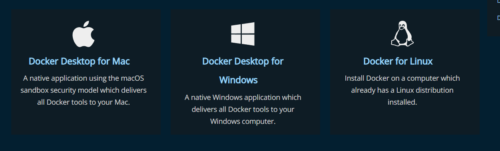
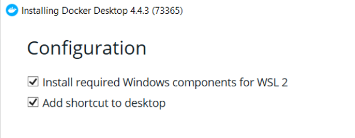
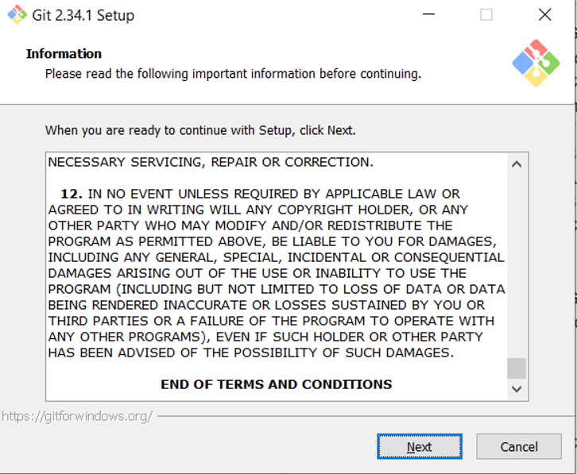
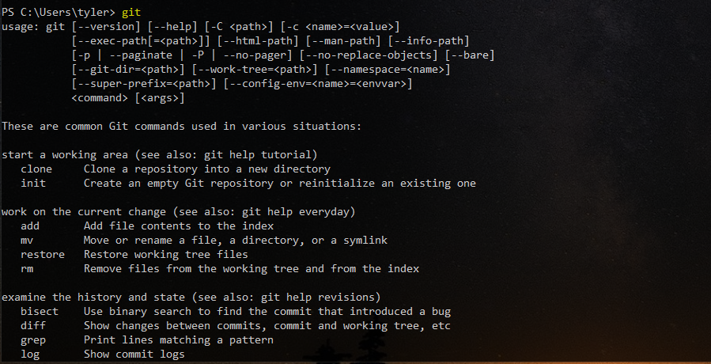

# Software

### Docker

Go to https://docs.docker.com/get-docker/ and select the operating system of your machine.

If you're mac is from 2020 or newer select Mac with Apple chip, otherwise select Mac with Intel chip.

If you're on windows select the Docker Desktop for Windows to begin downloading the installer.

&#x20;Once the installer opens, step through the defaults and if you're on windows be sure to select the Install required Windows component for WSL 2, finally accept the terms and conditions.

&#x20;Congratulations Docker is installed and ready to go!

### Git

Go to https://github.com/git-guides/install-git and download the installer for your operating system.

**Download installer** **windows** https://gitforwindows.org/

**Download installer mac:** https://sourceforge.net/projects/git-osx-installer/files/git-2.23.0-intel-universal-mavericks.dmg/download?use\_mirror=autoselect

Click through the installer.

Open your terminal of choice and execute the command `git` to verify it was properly installed. Your terminal output should look similar to the image below.&#x20;

Congratulations, git is now installed and ready to go!
