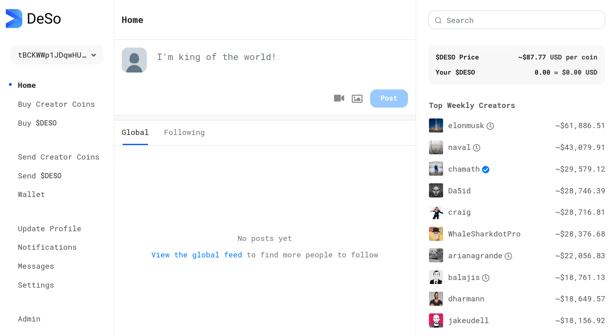
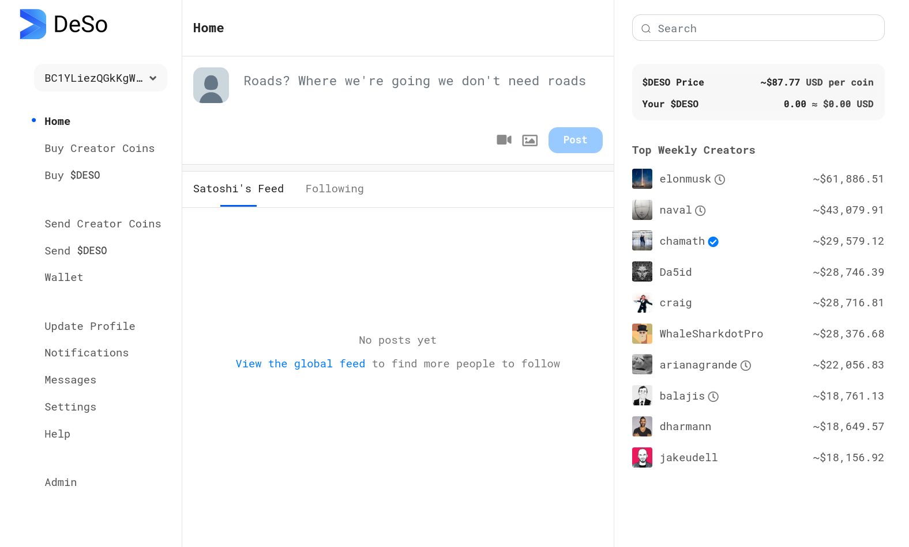
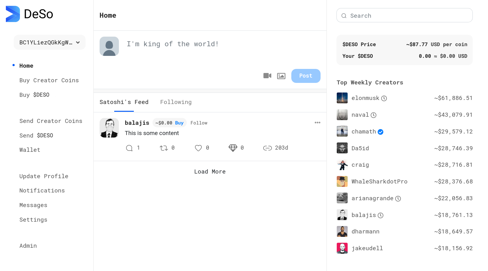

# Making Your First Changes

In this tutorial, we will show you how to make changes to the DeSo codebase, and see your changes reflected in a local dev environment.

## Prerequisites

This guide assumes you have successfully made it through [**Setting Up Your Dev Environment**](./). In particular, it assumes you have a testnet node running with n0\_test showing a frontend UI that looks roughly like the following screenshot:



## Make Your First Frontend Change

If your frontend repo is loaded into Goland, the following steps should allow you to make your first frontend change, and see it update your local node in real time:

* Run your n0\_test. Create an account and make sure you can see the page shown in the prerequisites.
* Assuming you're using Goland, navigate to the `feed.component.ts`. Hint: You can use SHIFT+SHIFT to easily jump to it.
* Look for the `GLOBAL_TAB` function in the file and modify the return statement as follows (you can name your feed whatever you want):
  * `static GLOBAL_TAB = "Satoshi's Feed";`
* Save your changes.

After your changes are saved, your browser should update to show a new title for your feed tab:



## Make Your First Backend Change

The backend repo runs an API that the frontend Angular app queries to get all of the information it displays. Let's make our first change to this API by following the steps below:

* Before going into the code, go to the Admin panel, add a post to the global feed, and verify that it shows up by refreshing the page.
* With the backend repo loaded in Goland, find the `post.go` file, which defines one of the API endpoints queried by the frontend. Hint: You can use SHIFT+SHIFT to navigate to it.
* In that file, find a function called `GetPostsStateless`. Modify the response at the end of the function as follows to customize the content:
  * ```
        if len(postEntryResponses) > 0 {
            postEntryResponses[0].Body = "This is some content"
        }

        // Return the posts found.
        res := &GetPostsStatelessResponse{
            PostsFound: postEntryResponses,
        }
    ```
* Save the file and restart n0\_test. When you make changes to anything in backend or core, you need to restart your node for them to take effect.

Now you should see some custom content in the post that you added to the feed. You can modify endpoints in backend like this one to customize how data is returned to the user.



## Make Your First Core Change

Your first core change will consist of adding the support of emoji reactions to posts.
We will implement this change by creating a new transaction from scratch.

### Adding a new transaction type
#### `network.go`

First, navigate to the `network.go` file in the `lib` folder.
The `network.go` file defines all the data structures used to form both messages and transactions over the network.
The first set of changes consists of adding constants to identify the new transaction type you are creating.

In `network.go`, perform the following changes:
* Add a new `TxnType` constant named `TxnTypeReact` and update the value of `NEXT_ID` to the next integer value.
```go
TxnTypeDAOCoinTransfer              TxnType = 25
TxnTypeReact                        TxnType = 26

// NEXT_ID = 27
)
```
* Add a new `TxnString` constant named `TxnStringReact`.
```go
TxnStringDAOCoinTransfer              TxnString = "DAO_COIN_TRANSFER"
TxnStringReact                        TxnString = "REACT"
TxnStringUndefined                    TxnString = "TXN_UNDEFINED"
)
```

Now, update functions, methods, and constants that use these constant values.

* Append the `TxnTypeReact` value to the `AllTxnTypes` `[]TxnType` slice.
```go
AllTxnTypes = []TxnType{
TxnTypeUnset, ...,
TxnTypeDAOCoin, TxnTypeDAOCoinTransfer, TxnTypeReact,
}
```
* Append the `TxnStringReact` value to the `AllTxnString` `[]TxnString` slice.
```go
AllTxnString = []TxnString{
TxnStringUnset, ...,
TxnStringDAOCoin, TxnStringDAOCoinTransfer, TxnStringReact,
}
```
* In `GetTxnString`, add a case for the `TxnTypeReact`.
```go
case TxnTypeDAOCoinTransfer:
    return TxnStringDAOCoinTransfer
case TxnTypeReact:
    return TxnStringReact
default:
    return TxnStringUndefined
```
* (_Optional_) In `GetTxnTypeFromString`, add a case for the `TxnStringReact`.
```go
case TxnStringDAOCoinTransfer:
    return TxnTypeDAOCoinTransfer
case TxnStringReact:
    return TxnTypeReact
default:
    // TxnTypeUnset means we couldn't find a matching txn type
    return TxnTypeUnset
}
```

Next, create a new transaction metadata type that records emoji reactions.
In this example, you can assume that a single transaction contains only one emoji reaction.
Multiple reactions to a single post would correspond to multiple transactions.

* At the end of the file, insert the following code block.
The new struct has a rune field to store the Unicode of the emoji reaction.
The `ToBytes` method validates the post hash and
then builds a byte slice containing both the validated post hash and the normalized NFC Unicode emoji reaction.
* Why use a normalized NFC Unicode?
It is possible for a single character to be encoded with different code point sequences.
By normalizing the Unicode, we ensure that a character will have a unique code point sequence.

```go
// ==================================================================
// ReactMetadata
//
// A reaction is an interaction where a user on the platform reacts to a post.
// ==================================================================

type ReactMetadata struct {
    // The user reacting is assumed to be the originator of the
    // top-level transaction.

    // The post hash to react to.
    PostHash *BlockHash

    // Set to true when a user is requesting to "remove" a reaction.
    IsRemove bool

    // The Unicode for the emoji reaction.
    EmojiReaction rune
}

func (txnData *ReactMetadata) GetTxnType() TxnType {
    return TxnTypeReact
}

func (txnData *ReactMetadata) ToBytes(preSignature bool) ([]byte, error) {
    // Validate the metadata before encoding it.
    //
    // Post hash must be included and must have the expected length.
    if len(txnData.PostHash) != HashSizeBytes {
        return nil, fmt.Errorf("ReactMetadata.ToBytes: PostHash "+
        "has length %d != %d", len(txnData.PostHash), HashSizeBytes)
    }

    var data []byte
    
    // Add PostHash
    //
    // We know the post hash is set and has the expected length, so we don't need
    // to encode the length here.
    data = append(data, txnData.PostHash[:]...)

    // Add IsRemove
    data = append(data, BoolToByte(txnData.IsRemove))
    
    // Add EmojiReaction.
    // It is possible for a single character to be encoded with different code point sequences.
    // By normalizing the Unicode (NFC), we ensure that a character will have a unique code point sequence.
    data = append(data, norm.NFC.Bytes([]byte(string(txnData.EmojiReaction)))...)

    return data, nil
}

func (txnData *ReactMetadata) FromBytes(data []byte) error {
    ret := ReactMetadata{}
    rr := bytes.NewReader(data)
    
    // PostHash
    ret.PostHash = &BlockHash{}
    _, err := io.ReadFull(rr, ret.PostHash[:])
    if err != nil {
        return fmt.Errorf(
        "ReactMetadata.FromBytes: Error reading PostHash: %v", err)
    }

    // IsRemove
    ret.IsRemove = ReadBoolByte(rr)

    // Emoji reaction
    reaction, _, err := rr.ReadRune()
    if err != nil {
        return fmt.Errorf(
        "ReactMetadata.FromBytes: Error reading EmojiReaction: %v", err)
    }
    
    ret.EmojiReaction = reaction
    *txnData = ret
    
    return nil
}

func (txnData *ReactMetadata) New() DeSoTxnMetadata {
    return &ReactMetadata{}
}
```

The last step before testing is to add this new transaction type metadata to the `NewTxnMetadata` function.
* In `NewTxnMetadata`, add a case for `TxnTypeReact`.

```go
case TxnTypeDAOCoinTransfer:
    return (&DAOCoinTransferMetadata{}).New(), nil
case TxnTypeReact:
    return (&ReactMetadata{}).New(), nil
default:
    return nil, fmt.Errorf("NewTxnMetadata: Unrecognized TxnType: %v; make sure you add the new type of transaction to NewTxnMetadata", txType)
}
```

#### `network_test`
You must test the new data structures that you created for React transactions.
Add the three tests below at the bottom of the `network_test.go` file.
The first test attempts to create a default `ReactMetadata` both manually and then by calling the `NewTxnMetadata` function.
After that, it attempts to convert `ReactMetadata` to bytes and then back to `ReactMetadata`.
The second and third tests perform similar actions but specify the IsRemove boolean and the emoji reaction to use, respectively.

```go
func TestSerializeNoReaction(t *testing.T) {
    require := require.New(t)
    
    txMeta := &ReactMetadata{PostHash: &postHashForTesting1}
    
    data, err := txMeta.ToBytes(false)
    require.NoError(err)
    
    testMeta, err := NewTxnMetadata(TxnTypeReact)
    require.NoError(err)
    err = testMeta.FromBytes(data)
    require.NoError(err)
    require.Equal(txMeta, testMeta)
}

func TestSerializeRemoveReaction(t *testing.T) {
    require := require.New(t)
    
    txMeta := &ReactMetadata{
      PostHash: &postHashForTesting1,
      IsRemove: true,
    }
    
    data, err := txMeta.ToBytes(false)
    require.NoError(err)
    
    testMeta, err := NewTxnMetadata(TxnTypeReact)
    require.NoError(err)
    err = testMeta.FromBytes(data)
    require.NoError(err)
    require.Equal(txMeta, testMeta)
}


func TestSerializeReactions(t *testing.T) {
    ValidReactions := []rune{'😊', '😥', '😠', '😮'}
    for _, r := range ValidReactions {
    _testSerializeSingleReaction(t, r)
    }
}

func _testSerializeSingleReaction(t *testing.T, emoji rune) {
    require := require.New(t)
    
    txMeta := &ReactMetadata{
    PostHash:      &postHashForTesting1,
    EmojiReaction: emoji,
    }
    
    data, err := txMeta.ToBytes(false)
    require.NoError(err)
    
    testMeta, err := NewTxnMetadata(TxnTypeReact)
    require.NoError(err)
    err = testMeta.FromBytes(data)
    require.NoError(err)
    require.Equal(txMeta, testMeta)
}
```

Ensure you can run the tests successfully, and you are good to go!

### Connecting and disconnecting transaction
For the next steps, it is advisable to review the [Transaction Validation](https://docs.deso.org/for-developers/walkthrough#transaction-validation) section of the documentation.

Up till now, you created the data structure for the react transaction. You will now need to add both the connect and disconnect logic.

#### Understanding the big picture
Although the core repository is not meant to be run as a stand-alone binary, exploring the main "happy path" 
will help you deepen your understanding of how your work fits in the larger system.
If you download the repository and run `./main run`, the following chain of commands happens:
- `cmd.Execute()` triggers the `Run` function in `run.go` in the `cmd` folder
- `Run` creates a go-routine that calls the `Start` method in the `node.go` file
- The `Start` method in the `node.go` file sets up the management processes before calling the `Start` method in the `server.go` file.
- The `Start` method in the `server.go` file starts the management processes. Among them, it creates a new goroutine to start the message handler `messageHandler`.
- Once the message handler `messageHandler` in `server.go` is up and running, it gets triggered when new incoming messages are present.
For the purposes of our first core change, we are interested in the handling of peer messages (i.e. `_handlePeerMessages`) that are of type `MsgDeSoBlock`.
- Incoming messages of type `MsgDeSoBlock` call the `_handleBlock` that performs minimal checks before calling `ProcessBlock` in `blockchain.go`.
- `ProcessBlock` performs some validations before adding the block to the longest chain.
- Before adding a block to the longest chain, a UTXO view is created.
A UTXO view is an in-memory object that represents the current tip of the blockchain.
Before validating a block, all the transactions in the block are applied to the UTXO view.
Terminology-wise, we say a transaction is connected to a view when its side effects are applied to the view.
Similarly, a transaction is disconnected from a view if its side effects were applied to the view but are now removed from the view.
If a series of connection and disconnection of transactions lead the system to a consistent state, then the system can move forward and validate the block. Eventually, the database will be updated to reflect the new block.
Otherwise, the view is deleted and the database is not updated.
- One optimization attempted by `ProcessBlock` is to preload relevant data from the database to avoid querying individual records when connecting every transaction. This is performed in `Preload` located in `block_view.go`.
- Next, `ConnectBlock` is called. It takes care of calling `ConnectTransaction` which relays the call to `_connectTransaction`.
It is at this stage that custom connect and disconnect transactions methods are triggered.
Before you can implement your custom connect and disconnect methods, you need to create some additional data structures.

#### `block_view_types.go`
##### `OperationTypeReact`
You will also need to add a new constant `OperationTypeReact` of the `NEXT_TAG` value
and increment the `NEXT_TAG` value in the documentation.

```go
OperationTypeReact                        OperationType = `NEXT_TAG`
```

##### `UtxoOperation`
Update the `UtxoOperation` to include previous reactions states. For instance, this is used when the transaction is disconnected and the system needs to rollback.
You can add the code snippet below after `PrevLikeCount`.

```go
// Save the previous emoji reactions
PrevReactEntry *ReactionEntry
PrevEmojiCount map[rune]uint64
```

##### `ReactionKey` and `ReactionEntry` and `MakeReactionKey`
Before we can start implementing the connect and disconnect logic, we need to create both a `ReactionKey` and `ReactionEntry` in `block_view_types.go`.
Place the snippet below after the `LikeEntry` type declaration. `ReactionKey` and `ReactionEntry` represent the key-value pair used to retrieve reaction-related data  in a `UtxoView`.
The `isDeleted` boolean field is used to determine whether the entry should be deleted when the view is flushed to the database.

```go
func MakeReactionKey(userPk []byte, ReactPostHash BlockHash) ReactionKey {
	return ReactionKey{
		// Avoid using the pointer so that it is easier to compare Reaction key structs
		ReactorPubKey:   *NewPublicKey(userPk),
		ReactedPostHash: ReactPostHash,
	}
}

type ReactionKey struct {
	ReactorPubKey   PublicKey
	ReactedPostHash BlockHash
}

type ReactionEntry struct {
	ReactorPubKey   []byte
	ReactedPostHash *BlockHash
	// Whether this entry is deleted in the view
	isDeleted bool
}

```

Unlike `LikeKey` that has a `PkMapKey` field, `ReactionKey` stores a pointer to a `PublicKey` because `PkMapKey` is deprecated.

**Why use `PublicKey` instead of `*PublicKey` as type for `ReactorPubKey`?** It is just for convenience.
Later, we will need to compare to `ReactionKeys` objects. When comparing, we will create a test `ReactionKey` key.
If we were to use a pointer `*PublicKey`, then the `ReactorPubKey` field would store the value of the address of test `PublicKey` value.


#### `block_view.go`
##### Updating `UtxoView`
In `block_view.go`, add the `ReactionKeyToReactionEntry` field in `UtxoView`. This is the field that will contain the some side effects of React transactions.
You can place it after the `LikeKeyToLikeEntry`.

```go
  // React data
  ReactionKeyToReactionEntry map[ReactionKey]*ReactionEntry
```

##### `_ResetViewMappingsAfterFlush`
We also need to initialize the map. Insert the code snippet below after the `LikeKeyToLikeEntry` initialization.

```go
  // Reaction data
  bav.ReactionKeyToReactionEntry = make(map[ReactionKey]*ReactionEntry)
```

##### `CopyUtxoView`
Update the `CopyUtxoView` method by placing the code below before the `// Copy the repost data` comment.

```go
  // Copy the react data
  newView.ReactionKeyToReactionEntry = make(map[ReactionKey]*ReactionEntry, len(bav.ReactionKeyToReactionEntry))
  for reactKey, reactEntry := range bav.ReactionKeyToReactionEntry {
      if reactEntry == nil {
          continue
      }

      newReactEntry := *reactEntry
      newView.ReactionKeyToReactionEntry[reactKey] = &newReactEntry
  }
```
##### `DisconnectTransaction` and `ConnectTransaction`

In `DisconnectTransaction`, add the following `else/if` block:
```go
 else if currentTxn.TxnMeta.GetTxnType() == TxnTypeReact {
    return bav._disconnectReact(
        OperationTypeReact, currentTxn, txnHash, utxoOpsForTxn, blockHeight)

  }
```

Add the following statements in `_connectTransaction` after the `TxnTypeLike` clause:
```go
else if txn.TxnMeta.GetTxnType() == TxnTypeReact {
		totalInput, totalOutput, utxoOpsForTxn, err =
			bav._connectReact(txn, txHash, blockHeight, verifySignatures)

	}
```

##### `Preload`
If you would like to integrate the full post reaction functionality,
you will need to update the `Preload` method. This will preload data in-memory and in caches.

### Implementing database utility methods
DeSo data is stored in both BadgerDB and PostgreSQL.

#### `postgres.go`
`postgres.go` contains the data structures and methods used to store and retrieve data in the Postgres database.

##### `PGTransaction`
Add a `MetadataReact` relationship to `PGTransaction` (below `MetadataLike`).
```go
MetadataReact               *PGMetadataReact               `pg:"rel:belongs-to,join_fk:transaction_hash"`
```

##### `PGMetadataReact`
After the `PGMetadataLike` struct declaration, add

```go
// PGMetadataReact represents ReactMetadata
type PGMetadataReact struct {
	tableName struct{} `pg:"pg_metadata_reactions"`

	TransactionHash *BlockHash `pg:",pk,type:bytea"`
	PostHash        *BlockHash `pg:",type:bytea"`
	IsRemove        bool       `pg:",use_zero"`
	EmojiReaction   rune       `pg:",type:integer"`
}
```

##### `NotificationReact`
Add a `NotificationReact` value in the `iota` enumeration after `NotificationLike`.

Then, open `notifier.go`, scroll to the `Update` method, and add an `else if` condition for the react transaction after the `TxnTypeLike`.

```go
} else if transaction.Type == TxnTypeReact {
    postHash := transaction.MetadataReact.PostHash
    post := DBGetPostEntryByPostHash(notifier.badger, postHash)
    if post != nil {
        notifications = append(notifications, &PGNotification{
            TransactionHash: transaction.Hash,
            Mined:           true,
            ToUser:          post.PosterPublicKey,
            FromUser:        transaction.PublicKey,
            Type:            NotificationReact,
            PostHash:        postHash,
            Timestamp:       block.Timestamp,
        })
    }
```

##### `PGReact`
You can start by creating a table representing a `ReactionEntry`. Using `go-pg`, all we need to do is define a Go struct
and `go-pg`'s takes care of creating the database table using ORM. For more information,
please visit [the official documentation](https://pg.uptrace.dev/models/).

Place the code snippet below just before the `PGFollow` type declaration.
```go
type PGReact struct {
	tableName struct{} `pg:"pg_react"`

	ReactorPublicKey []byte     `pg:",pk,type:bytea"`
	ReactorPostHash  *BlockHash `pg:",pk,type:bytea"`
}

func (react *PGReact) NewReactionEntry() *ReactionEntry {
	return &ReactionEntry{
		ReactorPubKey:   react.ReactorPublicKey,
		ReactedPostHash: react.ReactorPostHash,
	}
}
```

##### `flushReactions`
Add a `flushReactions` method before the `flushFollows` method.

```go

func (postgres *Postgres) flushReactions(tx *pg.Tx, view *UtxoView) error {
	var insertReacts []*PGReact
	var deleteReacts []*PGReact
	for _, reactionEntry := range view.ReactionKeyToReactionEntry {
		if reactionEntry == nil {
			continue
		}

		react := &PGReact{
			ReactorPublicKey: reactionEntry.ReactorPubKey,
			ReactorPostHash:  reactionEntry.ReactedPostHash,
		}

		if reactionEntry.isDeleted {
			deleteReacts = append(deleteReacts, react)
		} else {
			insertReacts = append(insertReacts, react)
		}
	}

	if len(insertReacts) > 0 {
		_, err := tx.Model(&insertReacts).WherePK().OnConflict("DO NOTHING").Returning("NULL").Insert()
		if err != nil {
			return err
		}
	}

	if len(deleteReacts) > 0 {
		_, err := tx.Model(&deleteReacts).Returning("NULL").Delete()
		if err != nil {
			return err
		}
	}

	return nil
}

```

Finally, add the methods to retrieve from the Postgres database after the `GetLikesForPost` method.

```go
//
// Reacts
//

func (postgres *Postgres) GetReaction(reactorPublicKey []byte, reactedPostHash *BlockHash) *PGReact {
	react := PGReact{
		ReactorPublicKey: reactorPublicKey,
		ReactorPostHash:  reactedPostHash,
	}
	err := postgres.db.Model(&react).WherePK().First()
	if err != nil {
		return nil
	}
	return &react
}

func (postgres *Postgres) GetReacts(reacts []*PGReact) []*PGReact {
	err := postgres.db.Model(&reacts).WherePK().Select()
	if err != nil {
		return nil
	}
	return reacts
}

func (postgres *Postgres) GetReactionsForPost(postHash *BlockHash) []*PGReact {
	var reacts []*PGReact
	err := postgres.db.Model(&reacts).Where("reactor_post_hash = ?", postHash).Select()
	if err != nil {
		return nil
	}
	return reacts
}
```

#### `db_utils.go`
`db_utils.go` contains all the functions that interact with the Badger DB database. It is the one used by default.

##### Prefixes
Add prefixes to the variable declarations after the `PrefixLikedPostHashToLikerPubKey` and increment the comment in `NEXT_TAG` accordingly.

```go
  // Prefixes for reactions:
  // <prefix, user pub key [33]byte, reacted post hash [32]byte> -> <>
  // <prefix, post hash [32]byte, user pub key [33]byte> -> <>
  _PrefixReactorPubKeyToPostHash = []byte{NEXT_TAG}
  _PrefixPostHashToReactorPubKey = []byte{NEXT_TAG+1}
```

##### Mapping functions
```go
// -------------------------------------------------------------------------------------
// React mapping functions
// 		<prefix, user pub key [33]byte, liked post BlockHash> -> <>
// 		<prefix, liked post BlockHash, user pub key [33]byte> -> <>
// -------------------------------------------------------------------------------------
//
func _dbKeyForReactorPubKeyToPostHashMapping(
	userPubKey []byte, postHash BlockHash) []byte {
	// Make a copy to avoid multiple calls to this function re-using the same slice.
	prefixCopy := append([]byte{}, _PrefixReactorPubKeyToPostHash...)
	key := append(prefixCopy, userPubKey...)
	key = append(key, postHash[:]...)
	return key
}

func _dbKeyForPostHashToReactorPubKeyMapping(
	postHash BlockHash, userPubKey []byte) []byte {
	// Make a copy to avoid multiple calls to this function re-using the same slice.
	prefixCopy := append([]byte{}, _PrefixPostHashToReactorPubKey...)
	key := append(prefixCopy, postHash[:]...)
	key = append(key, userPubKey...)
	return key
}

func _dbSeekPrefixForPostHashesYouReact(yourPubKey []byte) []byte {
	// Make a copy to avoid multiple calls to this function re-using the same slice.
	prefixCopy := append([]byte{}, _PrefixReactorPubKeyToPostHash...)
	return append(prefixCopy, yourPubKey...)
}

func _dbSeekPrefixForReactorPubKeysReactingToPostHash(likedPostHash BlockHash) []byte {
	// Make a copy to avoid multiple calls to this function re-using the same slice.
	prefixCopy := append([]byte{}, _PrefixPostHashToReactorPubKey...)
	return append(prefixCopy, likedPostHash[:]...)
}

// Note that this adds a mapping for the user *and* the liked post.
func DbPutReactMappingsWithTxn(
	txn *badger.Txn, userPubKey []byte, likedPostHash BlockHash) error {

	if len(userPubKey) != btcec.PubKeyBytesLenCompressed {
		return fmt.Errorf("DbPutReactMappingsWithTxn: User public key "+
			"length %d != %d", len(userPubKey), btcec.PubKeyBytesLenCompressed)
	}

	if err := txn.Set(_dbKeyForReactorPubKeyToPostHashMapping(userPubKey, likedPostHash), []byte{}); err != nil {
		return errors.Wrapf(err, "DbPutReactMappingsWithTxn: Problem adding user to reacted post mapping: ")
	}

	if err := txn.Set(_dbKeyForPostHashToReactorPubKeyMapping(likedPostHash, userPubKey), []byte{}); err != nil {
		return errors.Wrapf(err, "DbPutReactMappingsWithTxn: Problem adding reacted post to user mapping: ")
	}

	return nil
}

func DbPutReactMappings(
	handle *badger.DB, userPubKey []byte, likedPostHash BlockHash) error {

	return handle.Update(func(txn *badger.Txn) error {
		return DbPutReactMappingsWithTxn(txn, userPubKey, likedPostHash)
	})
}

func DbGetReactorPubKeyToPostHashMappingWithTxn(
	txn *badger.Txn, userPubKey []byte, likedPostHash BlockHash) []byte {

	key := _dbKeyForReactorPubKeyToPostHashMapping(userPubKey, likedPostHash)
	_, err := txn.Get(key)
	if err != nil {
		return nil
	}

	// Typically we return a DB entry here but we don't store anything for like mappings.
	// We use this function instead of one returning true / false for feature consistency.
	return []byte{}
}

func DbGetReactorPubKeyToReactedPostHashMapping(
	db *badger.DB, userPubKey []byte, likedPostHash BlockHash) []byte {
	var ret []byte
	db.View(func(txn *badger.Txn) error {
		ret = DbGetReactorPubKeyToPostHashMappingWithTxn(txn, userPubKey, likedPostHash)
		return nil
	})
	return ret
}

// Note this deletes the like for the user *and* the liked post since a mapping
// should exist for each.
func DbDeleteReactMappingsWithTxn(
	txn *badger.Txn, userPubKey []byte, postHash BlockHash) error {

	// First check that a mapping exists. If one doesn't exist then there's nothing to do.
	existingMapping := DbGetReactorPubKeyToPostHashMappingWithTxn(txn, userPubKey, postHash)
	if existingMapping == nil {
		return nil
	}

	// When a message exists, delete the mapping for the sender and receiver.
	if err := txn.Delete(
		_dbKeyForReactorPubKeyToPostHashMapping(userPubKey, postHash)); err != nil {
		return errors.Wrapf(err, "DbDeleteLikeMappingsWithTxn: Deleting "+
			"userPubKey %s and postHash %s failed",
			PkToStringBoth(userPubKey), postHash)
	}
	if err := txn.Delete(
		_dbKeyForPostHashToReactorPubKeyMapping(postHash, userPubKey)); err != nil {
		return errors.Wrapf(err, "DbDeleteLikeMappingsWithTxn: Deleting "+
			"postHash %s and userPubKey %s failed",
			PkToStringBoth(postHash[:]), PkToStringBoth(userPubKey))
	}

	return nil
}

func DbDeleteReactMappings(
	handle *badger.DB, userPubKey []byte, postHash BlockHash) error {
	return handle.Update(func(txn *badger.Txn) error {
		return DbDeleteReactMappingsWithTxn(txn, userPubKey, postHash)
	})
}

func DbGetPostHashesYouReact(handle *badger.DB, yourPublicKey []byte) (
	_postHashes []*BlockHash, _err error) {

	prefix := _dbSeekPrefixForPostHashesYouReact(yourPublicKey)
	keysFound, _ := _enumerateKeysForPrefix(handle, prefix)

	var postHashesYouReact []*BlockHash
	for _, keyBytes := range keysFound {
		// We must slice off the first byte and userPubKey to get the postHash.
		postHash := &BlockHash{}
		copy(postHash[:], keyBytes[1+btcec.PubKeyBytesLenCompressed:])
		postHashesYouReact = append(postHashesYouReact, postHash)
	}

	return postHashesYouReact, nil
}

func DbGetReactorPubKeysReactingToPostHash(handle *badger.DB, postHash BlockHash) (
	_pubKeys [][]byte, _err error) {

	prefix := _dbSeekPrefixForReactorPubKeysReactingToPostHash(postHash)
	keysFound, _ := _enumerateKeysForPrefix(handle, prefix)

	var userPubKeys [][]byte
	for _, keyBytes := range keysFound {
		// We must slice off the first byte and postHash to get the userPubKey.
		userPubKey := keyBytes[1+HashSizeBytes:]
		userPubKeys = append(userPubKeys, userPubKey)
	}

	return userPubKeys, nil
}
```

##### `ReactTxindexMetadata`
Add
```go
type ReactTxindexMetadata struct {
	// ReactorPublicKeyBase58Check = TransactorPublicKeyBase58Check
	IsUnlike bool

	PostHashHex string
	// PosterPublicKeyBase58Check in AffectedPublicKeys
}
```

##### `TransactionMetadata`
Add in `TransactionMetadata`
```go
ReactTxindexMetadata               *ReactTxindexMetadata               `json:",omitempty"`
```

#### `mempool.go`

Add in `mempool.go`, add a case to the switch statements
```go
case TxnTypeReact:
    realTxMeta := txn.TxnMeta.(*ReactMetadata)

    // ReactorPublicKeyBase58Check = TransactorPublicKeyBase58Check

    txnMeta.ReactTxindexMetadata = &ReactTxindexMetadata{
        IsRemove:    realTxMeta.IsRemove,
        PostHashHex: hex.EncodeToString(realTxMeta.PostHash[:]),
    }

    // Get the public key of the poster and set it as having been affected
    // by this like.
    //
    // PosterPublicKeyBase58Check in AffectedPublicKeys
    postHash := &BlockHash{}
    copy(postHash[:], realTxMeta.PostHash[:])
    postEntry := utxoView.GetPostEntryForPostHash(postHash)
    if postEntry == nil {
        glog.V(2).Infof(
            "UpdateTxindex: Error creating ReactTxindexMetadata; "+
                "missing post for hash %v: %v", postHash, err)
    } else {
        txnMeta.AffectedPublicKeys = append(txnMeta.AffectedPublicKeys, &AffectedPublicKey{
            PublicKeyBase58Check: PkToString(postEntry.PosterPublicKey, utxoView.Params),
            Metadata:             "PosterPublicKeyBase58Check",
        })
    }
```


#### `block_view_flush.go`
This file controls all the logic that happens when flushing to the BadgerDB database.

First, update the `FlushToDBWithTxn` method. Add the if-statement below.

```go
  if err := bav._flushReactEntriesToDbWithTxn(txn); err != nil {
      return err
  }
```

Add the `_flushReactEntriesToDbWithTxn`after the `_flushLikeEntriesToDbWithTxn` declaration.

```go
func (bav *UtxoView) _flushReactEntriesToDbWithTxn(txn *badger.Txn) error {

	// Go through all the entries in the ReactionKeyToReactionEntry map.
	for reactKeyIter, reactEntry := range bav.ReactionKeyToReactionEntry {
		// Make a copy of the iterator since we make references to it below.
		reactKey := reactKeyIter

		// Sanity-check that the ReactKey computed from the ReactEntry is
		// equal to the ReactKey that maps to that entry.
		reactKeyInEntry := MakeReactionKey(reactEntry.ReactorPubKey, *reactEntry.ReactedPostHash)
		if reactKeyInEntry != reactKey {
			return fmt.Errorf("_flushReactEntriesToDbWithTxn: ReactEntry has "+
				"ReactKey: %v, which doesn't match the ReactKeyToReactEntry map key %v",
				&reactKeyInEntry, &reactKey)
		}

		// Delete the existing mappings in the db for this ReactKey. They will be re-added
		// if the corresponding entry in memory has isDeleted=false.
		if err := DbDeleteReactMappingsWithTxn(
			txn, reactKey.ReactorPubKey[:], reactKey.ReactedPostHash); err != nil {

			return errors.Wrapf(
				err, "_flushReactEntriesToDbWithTxn: Problem deleting mappings "+
					"for LikeKey: %v: ", &reactKey)
		}
	}

	// Go through all the entries in the LikeKeyToLikeEntry map.
	for _, reactEntry := range bav.ReactionKeyToReactionEntry {

		if reactEntry.isDeleted {
			// If the LikeEntry has isDeleted=true then there's nothing to do because
			// we already deleted the entry above.
		} else {
			// If the LikeEntry has (isDeleted = false) then we put the corresponding
			// mappings for it into the db.
			if err := DbPutReactMappingsWithTxn(
				txn, reactEntry.ReactorPubKey, *reactEntry.ReactedPostHash); err != nil {

				return err
			}
		}
	}

	return nil
}
```

#### `errors.go`
In `errors.go`, add the code snippet below to the const declaration list after `RuleErrorCannotUnlikeWithoutAnExistingLike`.
```go
RuleErrorReactEntryAlreadyExists                       RuleError = "RuleErrorReactEntryAlreadyExists"
RuleErrorCannotReactNonexistentPost                    RuleError = "RuleErrorCannotReactNonexistentPost"
RuleErrorCannotRemoveReactionWithoutAnExistingReaction RuleError = "RuleErrorCannotRemoveReactionWithoutAnExistingReaction"
```

#### `blockchain.go`
In `blockchain.go`, add a `CreateReactTxn` method after the `CreateLikeTxn` implementation.

```go
func (bc *Blockchain) CreateReactTxn(
	userPublicKey []byte, postHash BlockHash, isRemove bool, emojiReaction rune,
	minFeeRateNanosPerKB uint64, mempool *DeSoMempool, additionalOutputs []*DeSoOutput) (
	_txn *MsgDeSoTxn, _totalInput uint64, _changeAmount uint64, _fees uint64,
	_err error) {

	// A React transaction doesn't need any inputs or outputs (except additionalOutputs provided).
	txn := &MsgDeSoTxn{
		PublicKey: userPublicKey,
		TxnMeta: &ReactMetadata{
			PostHash:      &postHash,
			EmojiReaction: emojiReaction,
			IsRemove:      isRemove,
		},
		TxOutputs: additionalOutputs,
		// We wait to compute the signature until we've added all the
		// inputs and change.
	}

	totalInput, spendAmount, changeAmount, fees, err :=
		bc.AddInputsAndChangeToTransaction(txn, minFeeRateNanosPerKB, mempool)
	if err != nil {
		return nil, 0, 0, 0, errors.Wrapf(
			err, "CreateReactTxn: Problem adding inputs: ")
	}

	// Sanity-check that the spendAmount is zero.
	if err = amountEqualsAdditionalOutputs(spendAmount, additionalOutputs); err != nil {
		return nil, 0, 0, 0, fmt.Errorf("CreateReactTxn: %v", err)
	}

	return txn, totalInput, changeAmount, fees, nil
}
```

### Creating custom reaction files 
#### `block_view_reaction.go`
`block_view_reaction.go` is inspired from `block_view_like.go`.
It defines setters and getters to the state generated by a `React` transaction to the UTXO view,
and implements custom `_connectReact` and `disconnectReact` transactions.

```go
package lib

import (
	"fmt"
	"github.com/btcsuite/btcd/btcec"
	"github.com/golang/glog"
	"github.com/pkg/errors"
	"reflect"
)

func (bav *UtxoView) _getReactionEntryForReactionKey(reactionKey *ReactionKey) *ReactionEntry {
	// If an entry exists in the in-memory map, return the value of that mapping.
	mapValue, existsMapValue := bav.ReactionKeyToReactionEntry[*reactionKey]
	if existsMapValue {
		return mapValue
	}

	// If we get here it means no value exists in our in-memory map. In this case,
	// defer to the db. If a mapping exists in the db, return it. If not, return
	// nil. Either way, save the value to the in-memory view mapping got later.
	reactionExists := false
	if bav.Postgres != nil {
		reactionExists = bav.Postgres.GetReaction(reactionKey.ReactorPubKey[:], &reactionKey.ReactedPostHash) != nil
	} else {
		reactionExists = DbGetReactorPubKeyToPostHashMapping(bav.Handle, reactionKey.ReactorPubKey[:], reactionKey.ReactedPostHash) != nil
	}

	if reactionExists {
		reactionEntry := ReactionEntry{
			ReactorPubKey:   reactionKey.ReactorPubKey[:],
			ReactedPostHash: &reactionKey.ReactedPostHash,
		}
		bav._setReactionEntryMappings(&reactionEntry)
		return &reactionEntry
	}

	return nil
}

func (bav *UtxoView) _setReactionEntryMappings(reactionEntry *ReactionEntry) {
	// This function shouldn't be called with nil.
	if reactionEntry == nil {
		glog.Errorf("_setReactionEntryMappings: Called with nil ReactionEntry; " +
			"this should never happen.")
		return
	}

	reactionKey := MakeReactionKey(reactionEntry.ReactorPubKey, *reactionEntry.ReactedPostHash)
	bav.ReactionKeyToReactionEntry[reactionKey] = reactionEntry
}

func (bav *UtxoView) _deleteReactionEntryMappings(reactionEntry *ReactionEntry) {

	// Create a tombstone entry.
	tombstoneReactionEntry := *reactionEntry
	tombstoneReactionEntry.isDeleted = true

	// Set the mappings to point to the tombstone entry.
	bav._setReactionEntryMappings(&tombstoneReactionEntry)
}

func (bav *UtxoView) GetReactionByReader(readerPK []byte, postHash *BlockHash) bool {
	// Get react state.
	reactionKey := MakeReactionKey(readerPK, *postHash)
	reactionEntry := bav._getReactionEntryForReactionKey(&reactionKey)
	return reactionEntry != nil && !reactionEntry.isDeleted
}

func (bav *UtxoView) GetReactionsForPostHash(postHash *BlockHash) (_ReactorPubKeys [][]byte, _err error) {
	if bav.Postgres != nil {
		reactions := bav.Postgres.GetReactionsForPost(postHash)
		for _, reaction := range reactions {
			bav._setReactionEntryMappings(reaction.NewReactionEntry())
		}
	} else {
		handle := bav.Handle
		dbPrefix := append([]byte{}, _PrefixPostHashToReactorPubKey...)
		dbPrefix = append(dbPrefix, postHash[:]...)
		keysFound, _ := EnumerateKeysForPrefix(handle, dbPrefix)

		// Iterate over all the db keys & values and load them into the view.
		expectedKeyLength := 1 + HashSizeBytes + btcec.PubKeyBytesLenCompressed
		for _, key := range keysFound {
			// Sanity check that this is a reasonable key.
			if len(key) != expectedKeyLength {
				return nil, fmt.Errorf("UtxoView.GetReactuibsForPostHash: Invalid key length found: %d", len(key))
			}

			reactorPubKey := key[1+HashSizeBytes:]
			reactKey := MakeReactionKey(reactorPubKey, *postHash)
			bav._getReactionEntryForReactionKey(&reactKey)
		}
	}

	// Iterate over the view and create the final list to return.
	var reactPubKeys [][]byte
	for _, reactionEntry := range bav.ReactionKeyToReactionEntry {
		if !reactionEntry.isDeleted && reflect.DeepEqual(reactionEntry.ReactedPostHash[:], postHash[:]) {
			reactPubKeys = append(reactPubKeys, reactionEntry.ReactorPubKey)
		}
	}

	return reactPubKeys, nil
}

func (bav *UtxoView) _connectReact(
	txn *MsgDeSoTxn, txHash *BlockHash, blockHeight uint32, verifySignatures bool) (
	_totalInput uint64, _totalOutput uint64, _utxoOps []*UtxoOperation, _err error) {

	// Check that the transaction has the right TxnType.
	if txn.TxnMeta.GetTxnType() != TxnTypeReact {
		return 0, 0, nil, fmt.Errorf("_connectReact: called with bad TxnType %s",
			txn.TxnMeta.GetTxnType().String())
	}
	txMeta := txn.TxnMeta.(*ReactMetadata)

	// Connect basic txn to get the total input and the total output without
	// considering the transaction metadata.
	totalInput, totalOutput, utxoOpsForTxn, err := bav._connectBasicTransfer(
		txn, txHash, blockHeight, verifySignatures)
	if err != nil {
		return 0, 0, nil, errors.Wrapf(err, "_connectReact: ")
	}

	if verifySignatures {
		// _connectBasicTransfer has already checked that the transaction is
		// signed by the top-level public key, which we take to be the sender's
		// public key so there is no need to verify anything further.
	}

	// At this point the inputs and outputs have been processed. Now we need to handle
	// the metadata.

	// There are two main checks that need to be done before allowing a reaction:
	//  - Check that the post exists
	//  - Check that the person hasn't already reacted with the same emoji

	//	Check that the post to react actually exists.
	existingPostEntry := bav.GetPostEntryForPostHash(txMeta.PostHash)
	if existingPostEntry == nil || existingPostEntry.isDeleted {
		return 0, 0, nil, errors.Wrapf(
			RuleErrorCannotReactNonexistentPost,
			"_connectReact: Post hash: %v", txMeta.PostHash)
	}

	// At this point the code diverges and considers the react flows differently
	// since the presence of an existing react entry has a different effect in either case.

	reactionKey := MakeReactionKey(txn.PublicKey, *txMeta.PostHash)
	existingReactEntry := bav._getReactionEntryForReactionKey(&reactionKey)
	// We don't need to make a copy of the post entry because all we're modifying is the emoji counts,
	// which isn't stored in any of our mappings. But we make a copy here just because it's a little bit
	// more foolproof.
	updatedPostEntry := *existingPostEntry

	if txMeta.IsRemove {
		// Ensure that there *is* an existing emoji entry to delete.
		if existingReactEntry == nil || existingReactEntry.isDeleted {
			return 0, 0, nil, errors.Wrapf(
				RuleErrorCannotRemoveReactionWithoutAnExistingReaction,
				"_connectReact: Like key: %v", &reactionKey)
		}

		// Now that we know there is a react entry, we delete it and decrement the emoji count.
		bav._deleteReactionEntryMappings(existingReactEntry)
		updatedPostEntry.EmojiCount[txMeta.EmojiReaction] -= 1
	} else {
		// Ensure that there *is not* an existing react entry.
		if existingReactEntry != nil && !existingReactEntry.isDeleted {
			return 0, 0, nil, errors.Wrapf(
				RuleErrorReactEntryAlreadyExists,
				"_connectReact: Like key: %v", &reactionKey)
		}

		// Now that we know there is no pre-existing reactentry, we can create one and
		// increment the react s on the react d post.
		reactEntry := &ReactionEntry{
			ReactorPubKey:   txn.PublicKey,
			ReactedPostHash: txMeta.PostHash,
		}
		bav._setReactionEntryMappings(reactEntry)
		if updatedPostEntry.EmojiCount == nil {
			updatedPostEntry.EmojiCount = make(map[rune]uint64)
		}
		updatedPostEntry.EmojiCount[txMeta.EmojiReaction] += 1
	}

	// Set the updated post entry so it has the new emoji count.
	bav._setPostEntryMappings(&updatedPostEntry)

	// Add an operation to the list at the end indicating we've added a follow.
	utxoOpsForTxn = append(utxoOpsForTxn, &UtxoOperation{
		Type:           OperationTypeReact,
		PrevReactEntry: existingReactEntry,
		PrevEmojiCount: existingPostEntry.EmojiCount,
	})

	return totalInput, totalOutput, utxoOpsForTxn, nil
}

func (bav *UtxoView) _disconnectReact(
	operationType OperationType, currentTxn *MsgDeSoTxn, txnHash *BlockHash,
	utxoOpsForTxn []*UtxoOperation, blockHeight uint32) error {

	// Verify that the last operation is a Reaction operation
	if len(utxoOpsForTxn) == 0 {
		return fmt.Errorf("_disconnectReact: utxoOperations are missing")
	}
	operationIndex := len(utxoOpsForTxn) - 1
	if utxoOpsForTxn[operationIndex].Type != OperationTypeReact {
		return fmt.Errorf("_disconnectReact: Trying to revert "+
			"OperationTypeReact but found type %v",
			utxoOpsForTxn[operationIndex].Type)
	}

	// Now we know the txMeta is a React
	txMeta := currentTxn.TxnMeta.(*ReactMetadata)

	// Before we do anything, let's get the post so we can adjust the emoji map counter later.
	reactedPostEntry := bav.GetPostEntryForPostHash(txMeta.PostHash)
	if reactedPostEntry == nil {
		return fmt.Errorf("_disconnectReact: Error getting post: %v", txMeta.PostHash)
	}

	// Here we diverge and consider the react and unreact cases separately.
	if txMeta.IsRemove {
		// If this is an remove we just need to add back the previous react entry and react
		// react count. We do some sanity checks first though to be extra safe.

		prevReactEntry := utxoOpsForTxn[operationIndex].PrevReactEntry
		// Sanity check: verify that the user on the reactEntry matches the transaction sender.
		if !reflect.DeepEqual(prevReactEntry.ReactorPubKey, currentTxn.PublicKey) {
			return fmt.Errorf("_disconnectReact: User public key on "+
				"ReactionEntry was %s but the PublicKey on the txn was %s",
				PkToStringBoth(prevReactEntry.ReactorPubKey),
				PkToStringBoth(currentTxn.PublicKey))
		}

		// Sanity check: verify that the post hash on the prevReactEntry matches the transaction's.
		if !reflect.DeepEqual(prevReactEntry.ReactedPostHash, txMeta.PostHash) {
			return fmt.Errorf("_disconnectLike: Liked post hash on "+
				"ReactionEntry was %s but the ReactedPostHash on the txn was %s",
				prevReactEntry.ReactedPostHash, txMeta.PostHash)
		}

		// Set the react entry and react count to their previous state.
		bav._setReactionEntryMappings(prevReactEntry)
		reactedPostEntry.EmojiCount = utxoOpsForTxn[operationIndex].PrevEmojiCount
		bav._setPostEntryMappings(reactedPostEntry)
	} else {
		// If this is a normal "react," we do some sanity checks and then delete the entry.

		// Get the ReactionEntry. If we don't find it or isDeleted=true, that's an error.
		reactKey := MakeReactionKey(currentTxn.PublicKey, *txMeta.PostHash)
		reactEntry := bav._getReactionEntryForReactionKey(&reactKey)
		if reactEntry == nil || reactEntry.isDeleted {
			return fmt.Errorf("_disconnectReact: ReactionEntry for "+
				"reactKey %v was found to be nil or isDeleted not set appropriately: %v",
				&reactKey, reactEntry)
		}

		// Sanity check: verify that the user on the reactEntry matches the transaction sender.
		if !reflect.DeepEqual(reactEntry.ReactorPubKey, currentTxn.PublicKey) {
			return fmt.Errorf("_disconnectReact: User public key on "+
				"ReactionEntry was %s but the PublicKey on the txn was %s",
				PkToStringBoth(reactEntry.ReactorPubKey),
				PkToStringBoth(currentTxn.PublicKey))
		}

		// Sanity check: verify that the post hash on the reactEntry matches the transaction's.
		if !reflect.DeepEqual(reactEntry.ReactedPostHash, txMeta.PostHash) {
			return fmt.Errorf("_disconnectReact: Reacted post hash on "+
				"ReactionEntry was %s but the ReactedPostHash on the txn was %s",
				reactEntry.ReactedPostHash, txMeta.PostHash)
		}

		// Now that we're confident the FollowEntry lines up with the transaction we're
		// rolling back, delete the mappings and set the reaction counter to its previous value.
		bav._deleteReactionEntryMappings(reactEntry)
		reactedPostEntry.EmojiCount = utxoOpsForTxn[operationIndex].PrevEmojiCount
		bav._setPostEntryMappings(reactedPostEntry)
	}

	// Now revert the basic transfer with the remaining operations. Cut off
	// the Like operation at the end since we just reverted it.
	return bav._disconnectBasicTransfer(
		currentTxn, txnHash, utxoOpsForTxn[:operationIndex], blockHeight)
}

```

#### `block_view_react_test`
This test is inspired from `TestLikeTxns` test in `block_view_like_test.go`.
At the moment, it only tests happy reactions to posts.

```go
package lib

import (
	"fmt"
	"github.com/dgraph-io/badger/v3"
	"github.com/stretchr/testify/require"
	"testing"
)

const (
	HappyReaction     = '😊'
	SadReaction       = '😥'
	AngryReaction     = '😠'
	SurprisedReaction = '😮'
)

func _doReactTxn(t *testing.T, chain *Blockchain, db *badger.DB,
	params *DeSoParams, feeRateNanosPerKB uint64, senderPkBase58Check string,
	postHash BlockHash, senderPrivBase58Check string, isRemove bool, emojiReaction rune) (
	_utxoOps []*UtxoOperation, _txn *MsgDeSoTxn, _height uint32, _err error) {

	require := require.New(t)

	senderPkBytes, _, err := Base58CheckDecode(senderPkBase58Check)
	require.NoError(err)

	utxoView, err := NewUtxoView(db, params, nil)
	require.NoError(err)

	txn, totalInputMake, changeAmountMake, feesMake, err := chain.CreateReactTxn(
		senderPkBytes, postHash, isRemove, emojiReaction, feeRateNanosPerKB, nil, []*DeSoOutput{})
	if err != nil {
		return nil, nil, 0, err
	}

	require.Equal(totalInputMake, changeAmountMake+feesMake)

	// Sign the transaction now that its inputs are set up.
	_signTxn(t, txn, senderPrivBase58Check)

	txHash := txn.Hash()
	// Always use height+1 for validation since it's assumed the transaction will
	// get mined into the next block.
	blockHeight := chain.blockTip().Height + 1
	utxoOps, totalInput, totalOutput, fees, err :=
		utxoView.ConnectTransaction(txn, txHash, getTxnSize(*txn), blockHeight, true, /*verifySignature*/
			false /*ignoreUtxos*/)
	// ConnectTransaction should treat the amount locked as contributing to the
	// output.
	if err != nil {
		return nil, nil, 0, err
	}
	require.Equal(totalInput, totalOutput+fees)
	require.Equal(totalInput, totalInputMake)

	// We should have one SPEND UtxoOperation for each input, one ADD operation
	// for each output, and one OperationTypeReact operation at the end.
	require.Equal(len(txn.TxInputs)+len(txn.TxOutputs)+1, len(utxoOps))
	for ii := 0; ii < len(txn.TxInputs); ii++ {
		require.Equal(OperationTypeSpendUtxo, utxoOps[ii].Type)
	}
	require.Equal(OperationTypeReact, utxoOps[len(utxoOps)-1].Type)

	require.NoError(utxoView.FlushToDb())

	return utxoOps, txn, blockHeight, nil
}

func TestReactTxns(t *testing.T) {
	require := require.New(t)

	chain, params, db := NewLowDifficultyBlockchain()
	mempool, miner := NewTestMiner(t, chain, params, true /*isSender*/)

	// Mine a few blocks to give the senderPkString some money.
	_, err := miner.MineAndProcessSingleBlock(0 /*threadIndex*/, mempool)
	require.NoError(err)
	_, err = miner.MineAndProcessSingleBlock(0 /*threadIndex*/, mempool)
	require.NoError(err)
	_, err = miner.MineAndProcessSingleBlock(0 /*threadIndex*/, mempool)
	require.NoError(err)
	_, err = miner.MineAndProcessSingleBlock(0 /*threadIndex*/, mempool)
	require.NoError(err)

	// Setup some convenience functions for the test.
	var txnOps [][]*UtxoOperation
	var txns []*MsgDeSoTxn
	var expectedSenderBalances []uint64
	var expectedRecipientBalances []uint64

	// We take the block tip to be the blockchain height rather than the
	// header chain height.
	savedHeight := chain.blockTip().Height + 1
	registerOrTransfer := func(username string,
		senderPk string, recipientPk string, senderPriv string) {

		expectedSenderBalances = append(
			expectedSenderBalances, _getBalance(t, chain, nil, senderPkString))
		expectedRecipientBalances = append(
			expectedRecipientBalances, _getBalance(t, chain, nil, recipientPkString))

		currentOps, currentTxn, _ := _doBasicTransferWithViewFlush(
			t, chain, db, params, senderPk, recipientPk,
			senderPriv, 7 /*amount to send*/, 11 /*feerate*/)

		txnOps = append(txnOps, currentOps)
		txns = append(txns, currentTxn)
	}

	// Fund all the keys.
	registerOrTransfer("", senderPkString, m0Pub, senderPrivString)
	registerOrTransfer("", senderPkString, m0Pub, senderPrivString)
	registerOrTransfer("", senderPkString, m1Pub, senderPrivString)
	registerOrTransfer("", senderPkString, m1Pub, senderPrivString)
	registerOrTransfer("", senderPkString, m1Pub, senderPrivString)
	registerOrTransfer("", senderPkString, m1Pub, senderPrivString)
	registerOrTransfer("", senderPkString, m1Pub, senderPrivString)
	registerOrTransfer("", senderPkString, m1Pub, senderPrivString)
	registerOrTransfer("", senderPkString, m2Pub, senderPrivString)
	registerOrTransfer("", senderPkString, m2Pub, senderPrivString)
	registerOrTransfer("", senderPkString, m2Pub, senderPrivString)
	registerOrTransfer("", senderPkString, m2Pub, senderPrivString)
	registerOrTransfer("", senderPkString, m3Pub, senderPrivString)
	registerOrTransfer("", senderPkString, m3Pub, senderPrivString)
	registerOrTransfer("", senderPkString, m3Pub, senderPrivString)
	registerOrTransfer("", senderPkString, m3Pub, senderPrivString)

	doReactTxn := func(
		senderPkBase58Check string, postHash BlockHash,
		senderPrivBase58Check string, isRemove bool, emojiReaction rune, feeRateNanosPerKB uint64) {

		expectedSenderBalances = append(
			expectedSenderBalances, _getBalance(t, chain, nil, senderPkString))
		expectedRecipientBalances = append(
			expectedRecipientBalances, _getBalance(t, chain, nil, recipientPkString))

		currentOps, currentTxn, _, err := _doReactTxn(
			t, chain, db, params, feeRateNanosPerKB, senderPkBase58Check,
			postHash, senderPrivBase58Check, isRemove, emojiReaction)
		require.NoError(err)

		txnOps = append(txnOps, currentOps)
		txns = append(txns, currentTxn)
	}

	submitPost := func(
		feeRateNanosPerKB uint64, updaterPkBase58Check string,
		updaterPrivBase58Check string,
		postHashToModify []byte,
		parentStakeID []byte,
		bodyObj *DeSoBodySchema,
		repostedPostHash []byte,
		tstampNanos uint64,
		isHidden bool) {

		expectedSenderBalances = append(
			expectedSenderBalances, _getBalance(t, chain, nil, senderPkString))
		expectedRecipientBalances = append(
			expectedRecipientBalances, _getBalance(t, chain, nil, recipientPkString))

		currentOps, currentTxn, _, err := _submitPost(
			t, chain, db, params, feeRateNanosPerKB,
			updaterPkBase58Check,
			updaterPrivBase58Check,
			postHashToModify,
			parentStakeID,
			bodyObj,
			repostedPostHash,
			tstampNanos,
			isHidden)

		require.NoError(err)

		txnOps = append(txnOps, currentOps)
		txns = append(txns, currentTxn)
	}

	fakePostHash := BlockHash{
		0x00, 0x01, 0x02, 0x03, 0x04, 0x05, 0x06, 0x07, 0x08, 0x09,
		0x10, 0x11, 0x12, 0x13, 0x14, 0x15, 0x16, 0x17, 0x18, 0x19,
		0x20, 0x21, 0x22, 0x23, 0x24, 0x25, 0x26, 0x27, 0x28, 0x29,
		0x30, 0x31,
	}
	// Attempting "m0 -> fakePostHash" should fail since the post doesn't exist.
	_, _, _, err = _doReactTxn(
		t, chain, db, params, 10 /*feeRateNanosPerKB*/, m0Pub,
		fakePostHash, m0Priv, false /*isRemove*/, HappyReaction)
	require.Error(err)
	require.Contains(err.Error(), RuleErrorCannotReactNonexistentPost)

	// p1
	submitPost(
		10,                                                 /*feeRateNanosPerKB*/
		m0Pub,                                              /*updaterPkBase58Check*/
		m0Priv,                                             /*updaterPrivBase58Check*/
		[]byte{},                                           /*postHashToModify*/
		[]byte{},                                           /*parentStakeID*/
		&DeSoBodySchema{Body: "m0 post body 1 no profile"}, /*body*/
		[]byte{},
		1602947011*1e9, /*tstampNanos*/
		false           /*isHidden*/)
	post1Txn := txns[len(txns)-1]
	post1Hash := *post1Txn.Hash()

	// p2
	{
		submitPost(
			10,                                                 /*feeRateNanosPerKB*/
			m0Pub,                                              /*updaterPkBase58Check*/
			m0Priv,                                             /*updaterPrivBase58Check*/
			[]byte{},                                           /*postHashToModify*/
			[]byte{},                                           /*parentStakeID*/
			&DeSoBodySchema{Body: "m0 post body 2 no profile"}, /*body*/
			[]byte{},
			1502947012*1e9, /*tstampNanos*/
			false           /*isHidden*/)
	}
	post2Txn := txns[len(txns)-1]
	post2Hash := *post2Txn.Hash()

	// p3
	{
		submitPost(
			10,                                                 /*feeRateNanosPerKB*/
			m1Pub,                                              /*updaterPkBase58Check*/
			m1Priv,                                             /*updaterPrivBase58Check*/
			[]byte{},                                           /*postHashToModify*/
			[]byte{},                                           /*parentStakeID*/
			&DeSoBodySchema{Body: "m1 post body 1 no profile"}, /*body*/
			[]byte{},
			1502947013*1e9, /*tstampNanos*/
			false           /*isHidden*/)
	}
	post3Txn := txns[len(txns)-1]
	post3Hash := *post3Txn.Hash()

	// m0 -> p1 (happy)
	doReactTxn(m0Pub, post1Hash, m0Priv, false /*isRemove*/, HappyReaction, 10 /*feeRateNanosPerKB*/)

	// Duplicating "m0 -> p1" should fail.
	_, _, _, err = _doReactTxn(
		t, chain, db, params, 10 /*feeRateNanosPerKB*/, m0Pub,
		post1Hash, m0Priv, false /*isRemove*/, HappyReaction)
	require.Error(err)
	require.Contains(err.Error(), RuleErrorReactEntryAlreadyExists)

	// m2 -> p1 (happy)
	doReactTxn(m2Pub, post1Hash, m2Priv, false /*isRemove*/, HappyReaction, 10 /*feeRateNanosPerKB*/)

	// m3 -> p1 (surprised)
	doReactTxn(m3Pub, post1Hash, m3Priv, false /*isRemove*/, HappyReaction, 10 /*feeRateNanosPerKB*/)

	// m3 -> p2 (sad)
	doReactTxn(m3Pub, post2Hash, m3Priv, false /*isRemove*/, HappyReaction, 10 /*feeRateNanosPerKB*/)

	// m1 -> p2 (angry)
	doReactTxn(m1Pub, post2Hash, m1Priv, false /*isRemove*/, HappyReaction, 10 /*feeRateNanosPerKB*/)

	// m2 -> p3 (surprised)
	doReactTxn(m2Pub, post3Hash, m2Priv, false /*isRemove*/, HappyReaction, 10 /*feeRateNanosPerKB*/)

	reactingP1 := [][]byte{
		_strToPk(t, m0Pub),
		_strToPk(t, m2Pub),
		_strToPk(t, m3Pub),
	}

	reactingP2 := [][]byte{
		_strToPk(t, m1Pub),
		_strToPk(t, m3Pub),
	}

	reactingP3 := [][]byte{
		_strToPk(t, m2Pub),
	}

	// Verify pks reacting p1 and check reactcount.
	{
		reactingPks, err := DbGetReactorPubKeysReactingToPostHash(db, post1Hash)
		require.NoError(err)
		require.Equal(len(reactingP1), len(reactingPks))
		for ii := 0; ii < len(reactingPks); ii++ {
			require.Contains(reactingP1, reactingPks[ii])
		}
		post1 := DBGetPostEntryByPostHash(db, &post1Hash)
		require.Equal(uint64(len(reactingP1)), post1.EmojiCount[HappyReaction])
	}

	// Verify pks reacting p2 and check reactcount.
	{
		reactingPks, err := DbGetReactorPubKeysReactingToPostHash(db, post2Hash)
		require.NoError(err)
		require.Equal(len(reactingP2), len(reactingPks))
		for ii := 0; ii < len(reactingPks); ii++ {
			require.Contains(reactingP2, reactingPks[ii])
		}
		post2 := DBGetPostEntryByPostHash(db, &post2Hash)
		require.Equal(uint64(len(reactingP2)), post2.EmojiCount[HappyReaction])
	}

	// Verify pks reacting p3 and check reactcount.
	{
		reactingPks, err := DbGetReactorPubKeysReactingToPostHash(db, post3Hash)
		require.NoError(err)
		require.Equal(len(reactingP3), len(reactingPks))
		for ii := 0; ii < len(reactingPks); ii++ {
			require.Contains(reactingP3, reactingPks[ii])
		}
		post3 := DBGetPostEntryByPostHash(db, &post3Hash)
		require.Equal(uint64(len(reactingP3)), post3.EmojiCount[HappyReaction])
	}

	m0Reacts := []BlockHash{
		post1Hash,
	}

	m1Reacts := []BlockHash{
		post2Hash,
	}

	m2Reacts := []BlockHash{
		post1Hash,
		post3Hash,
	}

	m3Reacts := []BlockHash{
		post1Hash,
		post2Hash,
	}

	// Verify m0's likes.
	{
		reactedPostHashes, err := DbGetPostHashesYouReact(db, _strToPk(t, m0Pub))
		require.NoError(err)
		require.Equal(len(m0Reacts), len(reactedPostHashes))
		for ii := 0; ii < len(reactedPostHashes); ii++ {
			require.Contains(m0Reacts, *reactedPostHashes[ii])
		}
	}

	// Verify m1's likes.
	{
		reactedPostHashes, err := DbGetPostHashesYouReact(db, _strToPk(t, m1Pub))
		require.NoError(err)
		require.Equal(len(m1Reacts), len(reactedPostHashes))
		for ii := 0; ii < len(reactedPostHashes); ii++ {
			require.Contains(m1Reacts, *reactedPostHashes[ii])
		}
	}

	// Verify m2's likes.
	{
		reactedPostHashes, err := DbGetPostHashesYouReact(db, _strToPk(t, m2Pub))
		require.NoError(err)
		require.Equal(len(m2Reacts), len(reactedPostHashes))
		for ii := 0; ii < len(reactedPostHashes); ii++ {
			require.Contains(m2Reacts, *reactedPostHashes[ii])
		}
	}

	// Verify m3's likes.
	{
		reactedPostHashes, err := DbGetPostHashesYouReact(db, _strToPk(t, m3Pub))
		require.NoError(err)
		require.Equal(len(m3Reacts), len(reactedPostHashes))
		for ii := 0; ii < len(reactedPostHashes); ii++ {
			require.Contains(m3Reacts, *reactedPostHashes[ii])
		}
	}

	// Try an "unlike."
	//
	// m0 -> p1 (unfollow, happy)
	doReactTxn(m0Pub, post1Hash, m0Priv, true /*isRemove*/, HappyReaction, 10 /*feeRateNanosPerKB*/)

	// m3 -> p2 (unfollow, happy)
	doReactTxn(m3Pub, post2Hash, m3Priv, true /*isRemove*/, HappyReaction, 10 /*feeRateNanosPerKB*/)
	
	// Duplicating "m0 -> p1" (unfollow) should fail.
	_, _, _, err = _doReactTxn(
		t, chain, db, params, 10 /*feeRateNanosPerKB*/, m0Pub,
		post1Hash, m0Priv, true /*isRemove*/, HappyReaction)
	require.Error(err)
	require.Contains(err.Error(), RuleErrorCannotRemoveReactionWithoutAnExistingReaction)

	reactingP1 = [][]byte{
		_strToPk(t, m2Pub),
		_strToPk(t, m3Pub),
	}

	reactingP2 = [][]byte{
		_strToPk(t, m1Pub),
	}

	// Verify pks reacting p1 and check reactcount.
	{
		reactingPks, err := DbGetReactorPubKeysReactingToPostHash(db, post1Hash)
		require.NoError(err)
		require.Equal(len(reactingP1), len(reactingPks))
		for ii := 0; ii < len(reactingPks); ii++ {
			require.Contains(reactingP1, reactingPks[ii])
		}
		post1 := DBGetPostEntryByPostHash(db, &post1Hash)
		require.Equal(uint64(len(reactingP1)), post1.EmojiCount[HappyReaction])
	}

	// Verify pks reacting p2 and check reactcount.
	{
		reactingPks, err := DbGetReactorPubKeysReactingToPostHash(db, post2Hash)
		require.NoError(err)
		require.Equal(len(reactingP2), len(reactingPks))
		for ii := 0; ii < len(reactingPks); ii++ {
			require.Contains(reactingP2, reactingPks[ii])
		}
		post2 := DBGetPostEntryByPostHash(db, &post2Hash
		require.Equal(uint64(len(reactingP2)), post2.EmojiCount[HappyReaction])
	}

	m3Reacts = []BlockHash{
		post1Hash,
	}

	// Verify m0 has no likes.
	{
		reactedPostHashes, err := DbGetPostHashesYouReact(db, _strToPk(t, m0Pub))
		require.NoError(err)
		require.Equal(0, len(reactedPostHashes))
	}

	// Verify m3's likes.
	{
		reactedPostHashes, err := DbGetPostHashesYouReact(db, _strToPk(t, m3Pub))
		require.NoError(err)
		require.Equal(len(m3Reacts), len(reactedPostHashes))
		for i := 0; i < len(reactedPostHashes); i++ {
			require.Contains(m3Reacts, *reactedPostHashes[i])
		}
	}

	// ===================================================================================
	// Finish it off with some transactions
	// ===================================================================================
	registerOrTransfer("", senderPkString, m0Pub, senderPrivString)
	registerOrTransfer("", senderPkString, m0Pub, senderPrivString)
	registerOrTransfer("", senderPkString, m0Pub, senderPrivString)
	registerOrTransfer("", senderPkString, m0Pub, senderPrivString)
	registerOrTransfer("", senderPkString, m0Pub, senderPrivString)
	registerOrTransfer("", senderPkString, m0Pub, senderPrivString)
	registerOrTransfer("", senderPkString, m1Pub, senderPrivString)
	registerOrTransfer("", senderPkString, m1Pub, senderPrivString)
	registerOrTransfer("", senderPkString, m1Pub, senderPrivString)
	registerOrTransfer("", senderPkString, m1Pub, senderPrivString)
	registerOrTransfer("", senderPkString, m1Pub, senderPrivString)
	registerOrTransfer("", senderPkString, m1Pub, senderPrivString)
	registerOrTransfer("", m0Pub, m1Pub, m0Priv)
	registerOrTransfer("", m1Pub, m0Pub, m1Priv)
	registerOrTransfer("", m1Pub, m0Pub, m1Priv)
	registerOrTransfer("", m0Pub, m1Pub, m0Priv)
	registerOrTransfer("", m1Pub, m0Pub, m1Priv)
	registerOrTransfer("", m0Pub, m1Pub, m0Priv)
	registerOrTransfer("", m1Pub, m0Pub, m1Priv)
	registerOrTransfer("", m0Pub, m1Pub, m0Priv)
	registerOrTransfer("", m1Pub, m0Pub, m1Priv)
	registerOrTransfer("", m1Pub, m0Pub, m1Priv)
	registerOrTransfer("", m0Pub, m1Pub, m0Priv)
	registerOrTransfer("", m0Pub, m1Pub, m0Priv)
	registerOrTransfer("", m0Pub, m1Pub, m0Priv)

	// Roll back all of the above using the utxoOps from each.
	for ii := 0; ii < len(txnOps); ii++ {
		backwardIter := len(txnOps) - 1 - ii
		currentOps := txnOps[backwardIter]
		currentTxn := txns[backwardIter]
		fmt.Printf(
			"Disconnecting transaction with type %v index %d (going backwards)\n",
			currentTxn.TxnMeta.GetTxnType(), backwardIter)

		utxoView, err := NewUtxoView(db, params, nil)
		require.NoError(err)

		currentHash := currentTxn.Hash()
		err = utxoView.DisconnectTransaction(currentTxn, currentHash, currentOps, savedHeight)
		require.NoError(err)

		require.NoError(utxoView.FlushToDb())

		// After disconnecting, the balances should be restored to what they
		// were before this transaction was applied.
		require.Equal(
			int64(expectedSenderBalances[backwardIter]),
			int64(_getBalance(t, chain, nil, senderPkString)))
		require.Equal(
			expectedRecipientBalances[backwardIter],
			_getBalance(t, chain, nil, recipientPkString))

		// Here we check the reactcounts after all the reactentries have been disconnected.
		if backwardIter == 19 {
			post1 := DBGetPostEntryByPostHash(db, &post1Hash)
			require.Equal(uint64(0), post1.EmojiCount[HappyReaction])
			post2 := DBGetPostEntryByPostHash(db, &post2Hash)
			require.Equal(uint64(0), post2.EmojiCount[HappyReaction])
			post3 := DBGetPostEntryByPostHash(db, &post3Hash)
			require.Equal(uint64(0), post3.EmojiCount[HappyReaction])
		}
	}

	testDisconnectedState := func() {
		// Verify that all the pks reacting each post hash have been deleted and reactcount == 0.
		{
			reactingPks, err := DbGetReactorPubKeysReactingToPostHash(db, post1Hash)
			require.NoError(err)
			require.Equal(0, len(reactingPks))
		}
		{
			reactingPks, err := DbGetReactorPubKeysReactingToPostHash(db, post2Hash)
			require.NoError(err)
			require.Equal(0, len(reactingPks))
		}
		{
			reactingPks, err := DbGetReactorPubKeysReactingToPostHash(db, post3Hash)
			require.NoError(err)
			require.Equal(0, len(reactingPks))
		}

		// Verify that all the post hashes reacted by users have been deleted.
		{
			reactedPostHashes, err := DbGetPostHashesYouReact(db, _strToPk(t, m0Pub))
			require.NoError(err)
			require.Equal(0, len(reactedPostHashes))
		}
		{
			reactedPostHashes, err := DbGetPostHashesYouReact(db, _strToPk(t, m1Pub))
			require.NoError(err)
			require.Equal(0, len(reactedPostHashes))
		}
		{
			reactedPostHashes, err := DbGetPostHashesYouReact(db, _strToPk(t, m2Pub))
			require.NoError(err)
			require.Equal(0, len(reactedPostHashes))
		}
		{
			reactedPostHashes, err := DbGetPostHashesYouReact(db, _strToPk(t, m3Pub))
			require.NoError(err)
			require.Equal(0, len(reactedPostHashes))
		}
	}
	testDisconnectedState()

	// Apply all the transactions to a mempool object and make sure we don't get any
	// errors. Verify the balances align as we go.
	for ii, tx := range txns {
		// See comment above on this transaction.
		fmt.Printf("Adding txn %d of type %v to mempool\n", ii, tx.TxnMeta.GetTxnType())

		require.Equal(expectedSenderBalances[ii], _getBalance(t, chain, mempool, senderPkString))
		require.Equal(expectedRecipientBalances[ii], _getBalance(t, chain, mempool, recipientPkString))

		_, err := mempool.ProcessTransaction(tx, false, false, 0, true)
		require.NoError(err, "Problem adding transaction %d to mempool: %v", ii, tx)
	}

	// Apply all the transactions to a view and flush the view to the db.
	utxoView, err := NewUtxoView(db, params, nil)
	require.NoError(err)
	for ii, txn := range txns {
		fmt.Printf("Adding txn %v of type %v to UtxoView\n", ii, txn.TxnMeta.GetTxnType())

		// Always use height+1 for validation since it's assumed the transaction will
		// get mined into the next block.
		txHash := txn.Hash()
		blockHeight := chain.blockTip().Height + 1
		_, _, _, _, err :=
			utxoView.ConnectTransaction(txn, txHash, getTxnSize(*txn), blockHeight, true /*verifySignature*/, false /*ignoreUtxos*/)
		require.NoError(err)
	}
	// Flush the utxoView after having added all the transactions.
	require.NoError(utxoView.FlushToDb())

	testConnectedState := func() {
		reactingP1 = [][]byte{
			_strToPk(t, m2Pub),
			_strToPk(t, m3Pub),
		}

		reactingP2 = [][]byte{
			_strToPk(t, m1Pub),
		}

		reactingP3 := [][]byte{
			_strToPk(t, m2Pub),
		}

		// Verify pks reacting p1 and check reactcount.
		{
			reactingPks, err := DbGetReactorPubKeysReactingToPostHash(db, post1Hash)
			require.NoError(err)
			require.Equal(len(reactingP1), len(reactingPks))
			for ii := 0; ii < len(reactingPks); ii++ {
				require.Contains(reactingP1, reactingPks[ii])
			}
			post1 := DBGetPostEntryByPostHash(db, &post1Hash)
			require.Equal(uint64(len(reactingP1)), post1.EmojiCount[HappyReaction])
		}

		// Verify pks reacting p2 and check reactcount.
		{
			reactingPks, err := DbGetReactorPubKeysReactingToPostHash(db, post2Hash)
			require.NoError(err)
			require.Equal(len(reactingP2), len(reactingPks))
			for ii := 0; ii < len(reactingPks); ii++ {
				require.Contains(reactingP2, reactingPks[ii])
			}
			post2 := DBGetPostEntryByPostHash(db, &post2Hash)
			require.Equal(uint64(len(reactingP2)), post2.EmojiCount[HappyReaction])
		}

		// Verify pks reacting p3 and check reactcount.
		{
			reactingPks, err := DbGetReactorPubKeysReactingToPostHash(db, post3Hash)
			require.NoError(err)
			require.Equal(len(reactingP3), len(reactingPks))
			for ii := 0; ii < len(reactingPks); ii++ {
				require.Contains(reactingP3, reactingPks[ii])
			}
			post3 := DBGetPostEntryByPostHash(db, &post3Hash)
			require.Equal(uint64(len(reactingP3)), post3.EmojiCount[HappyReaction])
		}

		m1Reacts := []BlockHash{
			post2Hash,
		}

		m2Reacts := []BlockHash{
			post1Hash,
			post3Hash,
		}

		m3Reacts = []BlockHash{
			post1Hash,
		}

		// Verify m0 has no likes.
		{
			followPks, err := DbGetPostHashesYouReact(db, _strToPk(t, m0Pub))
			require.NoError(err)
			require.Equal(0, len(followPks))
		}

		// Verify m1's likes.
		{
			reactedPostHashes, err := DbGetPostHashesYouReact(db, _strToPk(t, m1Pub))
			require.NoError(err)
			require.Equal(len(m1Reacts), len(reactedPostHashes))
			for ii := 0; ii < len(reactedPostHashes); ii++ {
				require.Contains(m1Reacts, *reactedPostHashes[ii])
			}
		}

		// Verify m2's likes.
		{
			reactedPostHashes, err := DbGetPostHashesYouReact(db, _strToPk(t, m2Pub))
			require.NoError(err)
			require.Equal(len(m2Reacts), len(reactedPostHashes))
			for ii := 0; ii < len(reactedPostHashes); ii++ {
				require.Contains(m2Reacts, *reactedPostHashes[ii])
			}
		}

		// Verify m3's likes.
		{
			reactedPostHashes, err := DbGetPostHashesYouReact(db, _strToPk(t, m3Pub))
			require.NoError(err)
			require.Equal(len(m3Reacts), len(reactedPostHashes))
			for ii := 0; ii < len(reactedPostHashes); ii++ {
				require.Contains(m3Reacts, *reactedPostHashes[ii])
			}
		}
	}
	testConnectedState()

	// Disconnect the transactions from a single view in the same way as above
	// i.e. without flushing each time.
	utxoView2, err := NewUtxoView(db, params, nil)
	require.NoError(err)
	for ii := 0; ii < len(txnOps); ii++ {
		backwardIter := len(txnOps) - 1 - ii
		fmt.Printf("Disconnecting transaction with index %d (going backwards)\n", backwardIter)
		currentOps := txnOps[backwardIter]
		currentTxn := txns[backwardIter]

		currentHash := currentTxn.Hash()
		err = utxoView2.DisconnectTransaction(currentTxn, currentHash, currentOps, savedHeight)
		require.NoError(err)
	}
	require.NoError(utxoView2.FlushToDb())
	require.Equal(expectedSenderBalances[0], _getBalance(t, chain, nil, senderPkString))
	require.Equal(expectedRecipientBalances[0], _getBalance(t, chain, nil, recipientPkString))

	testDisconnectedState()

	// All the txns should be in the mempool already so mining a block should put
	// all those transactions in it.
	block, err := miner.MineAndProcessSingleBlock(0 /*threadIndex*/, mempool)
	require.NoError(err)
	// Add one for the block reward. Now we have a meaty block.
	require.Equal(len(txnOps)+1, len(block.Txns))
	// Estimate the transaction fees of the tip block in various ways.
	{
		// Threshold above what's in the block should return the default fee at all times.
		require.Equal(int64(0), int64(chain.EstimateDefaultFeeRateNanosPerKB(.1, 0)))
		require.Equal(int64(7), int64(chain.EstimateDefaultFeeRateNanosPerKB(.1, 7)))
		// Threshold below what's in the block should return the max of the median
		// and the minfee. This means with a low minfee the value returned should be
		// higher. And with a high minfee the value returned should be equal to the
		// fee.
		require.Equal(int64(7), int64(chain.EstimateDefaultFeeRateNanosPerKB(0, 7)))
		require.Equal(int64(4), int64(chain.EstimateDefaultFeeRateNanosPerKB(0, 0)))
		require.Equal(int64(7), int64(chain.EstimateDefaultFeeRateNanosPerKB(.01, 7)))
		require.Equal(int64(4), int64(chain.EstimateDefaultFeeRateNanosPerKB(.01, 1)))
	}

	testConnectedState()

	// Roll back the block and make sure we don't hit any errors.
	{
		utxoView, err := NewUtxoView(db, params, nil)
		require.NoError(err)

		// Fetch the utxo operations for the block we're detaching. We need these
		// in order to be able to detach the block.
		hash, err := block.Header.Hash()
		require.NoError(err)
		utxoOps, err := GetUtxoOperationsForBlock(db, hash)
		require.NoError(err)

		// Compute the hashes for all the transactions.
		txHashes, err := ComputeTransactionHashes(block.Txns)
		require.NoError(err)
		require.NoError(utxoView.DisconnectBlock(block, txHashes, utxoOps))

		// Flushing the view after applying and rolling back should work.
		require.NoError(utxoView.FlushToDb())
	}

	testDisconnectedState()
}

```

Run the test and verify it succeeds.

Thank you and happy coding!