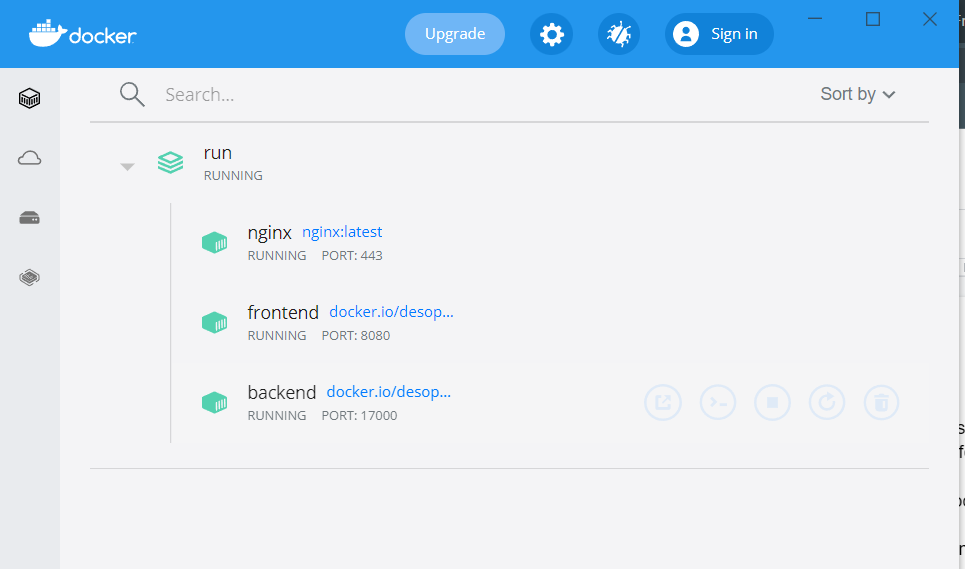

# Setup

Setting up a Deso Node is a simple process, but first verify that you have both [Broken link](broken-reference "mention") and [Broken link](broken-reference "mention") installed.

### Cloning The Repository&#x20;

Create a folder where you want your node to be held then open your terminal of choice in that location.

Execute the command `git clone` [`https://github.com/deso-protocol/run.git`](https://github.com/deso-protocol/run.git) in your terminal.

### Download The Containers

Once the installation is complete navigate to the run folder with `cd run` and execute the command `./run.sh`&#x20;

.PNG>)

A small terminal will appear and automatically download the containers for the node's frontend, backend, and nginx. This may take a few minutes.

Note in order to turn your node on or off open the Docker GUI navigate to the containers/apps tab, hover over the run tab, and hit the start/stop button to turn your node on or off.

Congratulations, your Deso node is now running locally! Navigate to [http://deso.run](http://deso.run) or locahost:8080 in your browser to see your local instance.&#x20;
